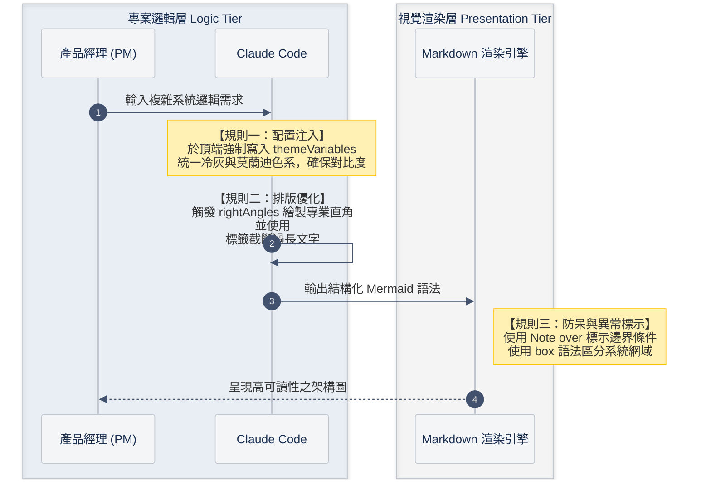

# Mermaid 循序圖高可讀性格式（mermaid-sequence-diagram）

任何要繪製或修改 `sequenceDiagram` 的任務，一律遵循以下三條規則。目標：統一冷灰與莫蘭迪色系、專業直角排線、清楚的系統分層，讓 PM/RD/QA 一眼讀懂。

## 規則一：配置注入（Config Injection）

於圖表**頂端強制寫入** frontmatter config（不使用舊式 `%%{init}%%`），統一冷灰與莫蘭迪色系、確保對比度：

```
---
config:
  theme: base
  rightAngles: true
  themeVariables:
    fontFamily: "Inter, Helvetica, Arial, sans-serif"
    primaryColor: "#F4F5F7"
    primaryBorderColor: "#C1C7D0"
    primaryTextColor: "#172B4D"
    signalColor: "#42526E"
    signalTextColor: "#333333"
    noteBkgColor: "#FFF0B3"
    noteBorderColor: "#FFC400"
---
```

| 變數 | 值 | 用途 |
| :--- | :--- | :--- |
| `primaryColor` | `#F4F5F7` | participant 底色（冷灰） |
| `primaryBorderColor` | `#C1C7D0` | participant 邊框 |
| `primaryTextColor` | `#172B4D` | participant 文字（深藍灰，高對比） |
| `signalColor` | `#42526E` | 訊息線 |
| `signalTextColor` | `#333333` | 訊息文字 |
| `noteBkgColor` / `noteBorderColor` | `#FFF0B3` / `#FFC400` | Note 底／框（暖黃，與冷灰對比突顯） |

## 規則二：排版優化（Layout）

* `rightAngles: true`：訊息線一律專業直角，不用弧線。
* **長文字用 `<br>` 截斷**：單行訊息／Note 文字過長（約 >18 全形字）就以 `<br>` 換行，避免拉寬整張圖。
* `autonumber` 一律開啟。

## 規則三：防呆與異常標示（Guard & Domain）

* **`box` 語法區分系統網域**：把 participant 依系統／層級分組，底色用低透明度 `rgba`，例如：

  ```
  box rgba(100,150,200,0.1) 求才系統 Recruit
      actor Emp as 求才廠商
      participant RF as 求才前端
  end
  box rgba(200,200,200,0.1) 共用基礎設施 Shared
      participant DB as 資料庫 (DB)
  end
  ```

* **`Note over` 標示邊界條件與異常**：前置檢查、逾時、防呆規則、狀態轉換等關鍵條件用 Note 明示，不藏在訊息文字內。
* 需要表達處理生命週期時可用 `activate` / `deactivate`。

### ⚠️ Gotcha：box 標題不可含半形括號

`box rgba(...) 標題` 的標題若含半形括號（如 `求才系統 (Recruit)`），mermaid 會解析失敗：整串 rgba 被當成標題文字、底色變 transparent（實測 mermaid v10.9）。**box 標題一律不加半形括號**，寫 `求才系統 Recruit` 即可；participant 的 `as` 別名則不受此限，可正常使用括號。

## 範本



## 適用範圍與遷移

* 新繪製的循序圖一律套用。
* 修改既有循序圖（如 HackMD 規格書內）時，順手把舊式 `%%{init}%%` 主題改為本 frontmatter 格式並補 `box` 分組。
* 僅適用 `sequenceDiagram`；flowchart 等其他圖型維持既有慣例（見 spec-doc-1111 skill）。
