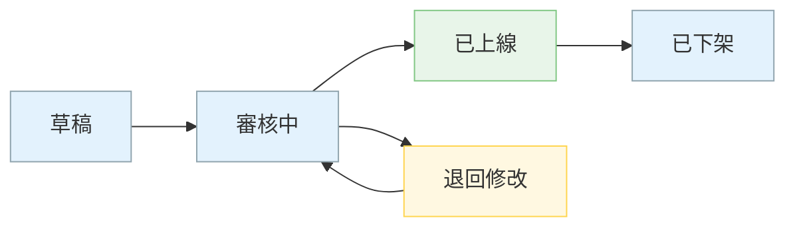

<!--markdownlint-disable MD033-->
<!--markdownlint-disable MD013-->
<!--
作品集 CASE STUDY 範本・台灣本土／新創／執行導向版（PM／系統分析）
適用：台灣本土企業、新創、內部系統／B2B 專案。外商／英文投遞用 [`portfolio-case-study.md`](portfolio-case-study.md)。
兩份範本共用同一批事實與數字：先定稿事實，再分別套版，不可兩版數字不一致。
長度：400–800 字。3–5 篇即可（深度 > 數量）。
三條底線（誠實契約優先於美觀）：
1. 全文去識別化，規則見 ../references/portfolio.md〈NDA 去識別化規則〉。
2. 沒有數據就標 〔待補數據〕，不編、不用假資料湊版面。
3. 只寫 PM 實際做過的事：寫「我怎麼梳理規格、怎麼對齊」，不寫工程架構的成果宣稱。
輸出位置固定在 career/portfolio/，不寫入 HackMD。
-->

# [Case Study 標題：系統／功能 ＋ 一句結果]
<!-- 例：「B2B 後台批次作業：把狀態與權限規則梳理成一份可交付的規格，如期上線」 -->

## ① 專案摘要

**時程**：[YYYY/MM–MM] ｜ **團隊規模**：[如 PM 1 ＋ 工程 5 ＋ 設計 1 ＋ 客服／業務窗口] ｜ **我的角色**：[如 主責 PM／系統分析，負責需求訪談、規格、跨部門對齊與上線追蹤]

**核心痛點**：
- [使用者或內部單位遇到的問題 1，白話描述現況與影響]
- [痛點 2]
- [痛點 3（選）]

## ② 系統分析與規格定義

[1–2 段。你怎麼把複雜邏輯拆開：先盤點有哪些狀態、哪些角色與權限、哪些規則會互相排斥，再寫成工程與測試都看得懂的條件表。講你的方法，不只講結論。]

- **狀態**：[如 草稿／審核中／上線／下架，以及狀態之間哪些轉換合法]
- **權限**：[如 主帳號／副帳號各能做什麼，用一張角色 × 功能表收斂]
- **互斥規則**：[如 A 開啟時 B 必須關閉，列出所有組合與預期結果，避免漏掉邊界]

<!-- 選用：附 1 張 Mermaid 圖（狀態圖或流程圖）。一律照 wiki/mermaid_styling_rules.md（柔和色系、classDef、長文字用  ），
並用 mermaid-cli 渲染驗證後才放進來。內容必須去識別化，節點名稱用通用說法。 -->

## ③ 跨部門協作與交付

- **跟工程對齊**：[怎麼對齊 API 規格——例如先用欄位與錯誤情境表跟後端逐項確認、哪些假設在 review 會議上被推翻、最後怎麼定版]
- **解掉互斥邏輯**：[遇到哪兩條規則衝突、你怎麼找出來、怎麼跟誰討論、最後選了哪個做法]
- **上線同步**：[怎麼跟業務／客服同步——例如上線前的說明文件、常見問答、公告時間點、上線後第一週的問題回收方式]

## ④ 成效指標

| 類型 | 指標 | 結果 |
| :--- | :--- | :--- |
| 質化 | [如 客服詢問類型變化、使用者回饋、內部流程變簡單] | [具體描述] |
| 量化 | [如 完成時間、錯誤率、客服來電量] | [before → after，用 % 或相對值；沒有數據寫 〔待補數據〕] |

<!-- 數字一律照去識別化規則處理（改 % 或相對值、級距化）。無法公開也無法換算的，寧可只寫質化。 -->

## ⑤ 學習與下一步

- **一個誠實的失敗或取捨**：[什麼地方判斷錯了、或為了時程砍了什麼範圍，以及它怎麼影響後來的做法]
- **後續迭代方向**：[下一版想解決什麼、需要什麼資料或資源才能判斷值不值得做]

---

<!-- 排版提醒：標題清楚、關鍵指標粗體、手機可讀。履歷只放「一行＋量化結果＋[見作品集案例]」，完整過程留在這裡。 -->
