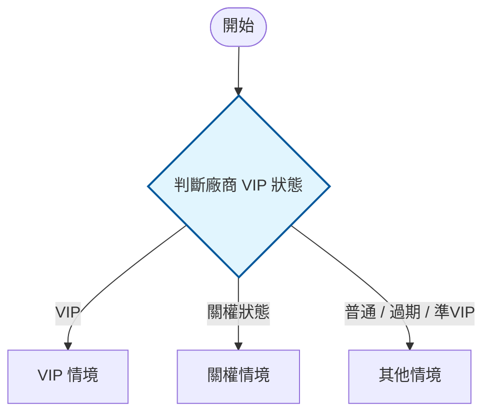

# 1111 規格書撰寫格式（spec-doc-1111）

本 skill 封裝 1111 人力銀行 recruit 專案在 HackMD 上的功能規格書格式慣例。目標是讓任何 project 產出的規格文件，
在結構、編號、樣式、用語上都與既有文件（如 `B.4 刊登設定`、`3.2.6 AI推薦人才名單`）一致，QA 與 RD 可無縫接續閱讀。

撰寫前若手邊有完整骨架範本，可直接複製 `assets/template.md` 開始填寫，再依下列規則調整。

## 何時使用

- 從零撰寫某功能的規格書
- 把設計截圖、口語需求、會議記錄轉成正式規格
- 依 QA／RD 回饋修改既有規格（改章節、補狀態情境、標紅字新需求）
- 補上流程圖、版控紀錄、欄位判斷邏輯
- 整理既有文件中散落的權限判斷，重整為標準初始化格式

## 核心原則

1. **狀態／情境驅動**：規格以「判斷某狀態 → 顯示某樣式／行為」的方式描述，少用散文，多用條列與判斷分支。
2. **欄位即真相**：所有 DB 欄位、旗標、權限代碼、狀態值一律用反引號標出，例如 `organs.showfield&4096`、`oStatus:1`、`代碼9`、`status = 0,2,4,5,6`。
3. **變更必標紅**：新需求或這版調整的內容，用紅字標記，方便 RD/QA 一眼看出差異。
4. **格式穩定**：未變更的區塊不要動排版、縮排、圖片、編號 —— 保持可 diff。
5. **MECE 狀態涵蓋**：每個 UI 區塊必須完整涵蓋四種狀態：`載入中` / `有資料` / `無資料` / `錯誤`，缺一不可。

---

## 文件骨架（務必依此順序）

```markdown
<!--markdownlint-disable MD033-->
<!--markdownlint-disable MD013-->

# {代號} {功能名稱}

User Story: `身為一個 {Persona}，我想要 {做什麼}，以便 {達成什麼目標}`
Use Case: `{調用端＋執行動作＋受影響標的物}`

:::spoiler Document info

文件版本：v{x.y.z}
最後更新：{yyyy/mm/dd}
文件作者：{作者}
文件狀態： <span style="color:blue">{已發布／草稿／審查中}</span></h6>
功能位置：
<{該功能的 URL}>（尚無確定 URL 時直接寫 `TBD`，不要放推測的網址＋待補註解）

## 版控紀錄

| 版本 | 日期 | 作者 | 調整說明（異動區段 + 內容摘要） |
| :---: | :--- | :--- | :--- |
| 0.1 | {yyyy-mm-dd} | {作者} | 初版 |

[TOC]

:::

## 示意圖

{直接嵌入 wireframe 或流程示意圖，禁止放外部 URL。沒有則標示：`待補`}

## 初始化

### 進入路徑

* {入口一：導覽路徑或跨文件連結，例：[信件列表 規格文件](/noteId) 點擊任一對話進入聊天室}
* {入口二：例：右下角浮動面板點擊展開}

（每個入口直接條列即可，**不必加「路徑 A／B／C」標籤**；入口若有截圖，圖緊貼該 bullet 下方。若只有一個進入點，刪除此節，直接在 初始化 下說明）

### 權限判斷

進入頁面時，依序驗證以下條件（代碼定義見 [求才系統權限代碼表]({noteId})）：

| 權限條件 | 代碼 | 不符合時的處理 |
| :--- | :---: | :--- |
| 廠商需為 VIP | `oStatus = 1` | 顯示 Alert：「...」，點擊後返回首頁 |
| 帳號需有 XX 管理權限 | `代碼XX` | 顯示無權限 Alert，返回首頁 |

### 資料載入

* 進入畫面時載入：{資料名稱／API說明}
* Responsive 斷點：{如有填寫，無則刪除此行}

## 1.{第一個區塊}

...
```

說明：

- `MD033` 關閉「禁止內嵌 HTML」、`MD013` 關閉行長限制 —— 因為文件大量使用 `<font>`、`<image>`、`<ul>` 等標籤。兩行固定放最上方。
- 標題 `# {代號} {功能名稱}`：代號形如 `B.4`、`A.2`，與功能模組對應。
- 標題下接 **User Story**（Persona 角度）與 **Use Case**（系統角度）各一行，**內容整句用反引號包起來**（`User Story: \`身為…\``），不加其他修飾。
- `Document info` 用 `:::spoiler` 摺疊，內含版本／更新日／作者／狀態／功能位置／版控表／`[TOC]`，全部包在同一個 spoiler 內。
- 文件狀態用彩色 span：已發布常用藍色 `<span style="color:blue">已發布</span>`；草稿用灰色。結尾的 `</h6>` 沿用既有文件寫法即可。
- 功能位置 URL 用角括號包起來自動連結：`<https://recruit-qa.1111.com.tw/...>`；**尚未確定時直接寫 `TBD`**，不要放推測的 URL 再加待補註解。`## 示意圖` 同理：沒有合適的整頁示意圖就只寫 `待補`，不要先拿入口截圖或局部圖充數。
- **特別提醒**：list 的每一層縮排**必須用兩個空格**（不是一個、不是 Tab），HackMD markdown 解析才會正確識別巢狀層級。

---

## `## 初始化` 內部結構（重要）

`初始化` 固定是第一個 H2 章節，不編號，固定包含三個 H3 子節：

### `### 進入路徑`
列出所有能進入此頁的路徑。若只有一個進入點，可省略此節並在 初始化 intro 說明。

### `### 權限判斷`
**所有廠商與帳號的權限／先決條件判斷一律集中在此節的表格內**，不得散落在後續章節中的 bullet 或紅字。

表格格式：
```markdown
| 權限條件 | 代碼 | 不符合時的處理 |
| :--- | :---: | :--- |
| 廠商不得為黑名單屬性 | `confirmed&4096` | 顯示 Alert，點擊後返回首頁 |
| 帳號需有職缺管理權限 | `代碼54` | 隱藏操作按鈕，僅顯示唯讀狀態 |
```

- 代碼欄位一律用反引號。
- 「不符合時的處理」寫明使用者看到什麼（Alert 文案、跳轉去哪、哪些元素 disabled）。
- 所有代碼的完整定義見共用參考文件「求才系統權限代碼表」。**跨文件連結文字直接用文件名稱**，不加 `[REF]` 之類的前綴。
- 表格儲存格已標 `待補` 的項目，**不要再於表格下方加紅字段落重述同一件事**——同一個待補只標一次。

#### 帳號權限 vs 廠商權限（絕對不可混淆）

求才系統的「權限」分兩個層級，規格書權限判斷表中必須**分開列、用語不可互換**：

| 層級 | 主體 | 形式 | 範例 |
| :--- | :--- | :--- | :--- |
| **帳號權限** | 登入帳號（主帳號／副帳號） | 整數權限代碼（可組合） | `代碼53`、`10+26`、`代碼51` |
| **廠商權限／狀態** | 廠商（公司） | 狀態值與 bit-flag 欄位 | `oStatus:1`、`organs.confirmed&4096`、`organs.showfield&4096` |

- 每個廠商名下有一個**主帳號**（權限最大、全開放、不可被限制）與多個**副帳號**（權限可於帳號設定逐項勾選）。
- 帳號權限代碼對應功能的 **C/R/U/D** 操作：讀取範圍（R）用「主代碼+範圍代碼」組合控制帳號可看到哪些資料——帳號 `7+22`/`7+23`、聯絡人 `8+24`/`8+25`、職缺 `10+26`/`10+27`、範本 `14+28`/`14+29`、人才庫 `16+30`/`16+31`、簡訊 `43+32`/`43+33`（前＝只管理個人、後＝可管理所有）；新增／修改、刪除、開關等為獨立代碼（如職缺 `53`/`50`/`54`）。
- 無代碼時的共通行為：不顯示功能入口；以 URL 直接進入時顯示不可修改 Alert、點擊後返回上一頁（內網仍可見入口，進入同樣顯示 Alert）。
- 規格書中**凡提及帳號權限，一律附上 [求才系統權限代碼表](/B1j3sN-bzx) 連結**，代碼名稱以代碼表的「新版 Label」為準。
- 用字一律「權限」，不用異體「権限」。

### `### 資料載入`
說明頁面進入時需撈取哪些資料、呼叫哪些 API（或 DB 查詢），以及若有 `@media` 斷點規則需在此記錄。

---

## 章節編號階層

由大到小固定四層，編號要能對應到畫面上的標號：

| 層級 | Markdown | 範例 | 用途 |
| --- | --- | --- | --- |
| 大區塊 | `## 1.合約資料` | `## 2 刊登狀態` | 對應頁面主要區塊，從 1 開始；`初始化` 不編號放最前 |
| 情境 | `### 廠商無合約情境` | `### 關權狀態情境` | 同一區塊下的不同狀態／情境 |
| 子區塊 | `#### 1-1 當期合約` | `#### 2-4 重新開啟職缺設定` | 對應畫面元件，編號 `{區塊}-{序}` |
| 元件細項 | `**1-1-1 可刊登天數**` | `**2-2-1 排程設定**` | 粗體，編號 `{區塊}-{子}-{序}`；更深一層可用 `2-2-2` 等子項條列 |

編號要與設計圖上的標號一致，讓 RD/QA 對照畫面。`初始化` 章節固定放在所有編號章節之前且不編號。

### 現版（既有 iframe）Lightbox 的章節安排

新版畫面以 iframe 嵌入的**現版既有 lightbox**（發送通知、封鎖、紀錄管理…），**集中為一個編號章**（如 `### 3 現版Lightbox`），各 lightbox 作為其子節，**子節編號用 dash**：`#### 3-1 發送通知 Lightbox`、`#### 3-2 新增封鎖 Lightbox`…：

- **不要**把每個 lightbox 拆成各自獨立的大章（3、4、5…）。
- 子節之間**不加 `---` 分隔線**（`---` 只用於大章之間）。
- 內部欄位規則以既有規格為準（交叉連結舊文件），新版只定義「如何開啟、帶入哪些資料、回到畫面如何呈現」。

### 開發階段拆分（如文件有分階段）

依開發階段拆分時，大架構順序固定為：

```
## 初始化 → ## 第一階段內容（UI 區塊 §1、§2…降為 H3） → ## 第二階段內容 → ## 跨系統流程與後端邏輯
```

- 延後實作的功能（含其截圖）整節搬到 `## 第二階段內容` 下，各為一個 H3，並以 `> 來源：原 §x.x` 註明出處。
- **跨系統流程與後端邏輯為獨立 H2**（不屬於任何階段），子節用 H3 點號編號（`### 6.1`、`### 6.2`…）。

---

## MECE 狀態涵蓋（每個 H4 子區塊均須覆蓋）

每個 `#### 子區塊` 描述 UI 元件時，必須覆蓋四種狀態（即使某些狀態是「不適用」也要明示）：

```markdown
#### 1-1 {子區塊名稱}

| 狀態 | 觸發條件 | 畫面呈現 |
| :--- | :--- | :--- |
| 載入中 | 資料尚未回傳 | 顯示 loading 動畫 |
| 有資料 | API 正常回傳 | {描述正常畫面} |
| 無資料 | API 回傳空陣列 | {Empty State 文案 + 排版間距} |
| 錯誤 | API 失敗 / 權限不符 | {顯示 toast / alert，文案：「...」} |
```

此表替代過去「無資料時顯示空值狀態」散落在各 bullet 的寫法，確保 QA 能系統性驗收。

---

## 樣式與符號慣例

### 紅字：新需求／本版變更

新增或修改的需求，整段用紅字包起來，版控紀錄的「調整說明」要寫明異動區段：

```markdown
* <font style="color:red">**1-2-2 下期合約可暫停天數** `useDeadline`-`deadline_open`</font>
```

標題也可整行標紅：`##### <font style="color:red">2-1-1 預計開權時間`（紅字 `<font>` 可跨多個條列，於段落結尾再 `</font>`）。

### 欄位、旗標、狀態值：反引號

所有程式可辨識的值都用反引號，避免與說明文字混淆：

- 旗標位元運算：`organs.confirmed&131072`、`organs.showfield&4096`、`organsMore:setKind&16`
- 狀態值：`oStatus:1`、`oStatus:3`、`iskeepemployeesstatus:true`
- 權限代碼：`代碼9`、`權限代碼26`、`權限代碼27`、`（46）`
- 廠商狀態集合：`status = 0,2,4,5,6`
- 計算式：`合約結束日`-`今日日期`、`useDeadline-今天`

### 版控紀錄調整說明格式

每次發布必須在版控表新增一列，**新列一律 append 在表格「最後一列之後」**（時間升冪，版號最大／最新版永遠在最下方）；**不可插在中間、也不可倒序**。**調整說明格式**：`[異動區段] 說明內容`

- ✗ 不可只寫：「更新文件」
- ✓ 應寫：「[進入畫面權限判斷] 新增 `confirmed&131072` 外網限制，整合為權限判斷表格」
- ✓ 應寫：「[1-1-2 可暫停天數] 補充 2077/7/7 無限期顯示邏輯」

### 圖片

- 全寬示意圖：``
- 限寬內嵌圖（手機版／小元件）：`<image style="max-width:375px" src="..."></image>` 或 ``
- 常見寬度：手機版 `375px`、空狀態 `500px`、列表 `800px`、tooltip `300px`

### 截圖標注／覆蓋（從 Figma 產生規格截圖）

當設計稿與規格需求有落差，或要在畫面上補規格章節標號時，用 Pillow 在截圖上疊加，**不要求設計稿與規格完全一致**——目的是示意落差與對應章節。流程：

1. **抓圖**：`mcp__Figma__get_screenshot`（傳 `nodeId`＋`fileKey`，`maxDimension` 視需要放大，預設回傳短效 URL），用 `curl` 下載 PNG。需要定位元件座標時再呼叫 `get_design_context`（輸出大時用 `excludeScreenshot:true`、再從存檔檔案 grep `data-node-id`）。
2. **定位**：用 Pillow 逐列掃描像素（無 numpy 時用 `img.getpixel`）找出區塊邊界（底色、border、文字色），決定覆蓋與標號座標。
3. **覆蓋改字**：在目標區先畫白底矩形蓋掉舊內容，再用 `ImageDraw.text` 重寫。中文字型用 `/usr/share/fonts/truetype/wqy/wqy-zenhei.ttc`（系統無 Noto TC 時的後備）。
4. **章節標號徽章**：紅／珊瑚紅底（`#F2675F`）圓角矩形＋白色粗體數字，`N` 放區塊左上、`N.M` 貼元件左上（見 CLAUDE.md「截圖標號慣例」）。
5. **落差標注**（選用）：黃框（`outline=(255,200,0)`）圈出與設計稿不同處，旁邊以文字注明「規格：XX／現況：OO」。用 `Image.alpha_composite` 疊半透明層。
6. **裁切成小圖**：`img.crop((x0,y0,x1,y1))` 只留相關區塊，避免整頁大圖。
7. **入庫**：HackMD 的 `POST /notes/:noteId/upload` 目前不可用；改將圖 commit 到 `repo .claude/assets/`、push 後用 `https://raw.githubusercontent.com/sulfurcreek/main/{commit}/.claude/assets/{file}.png` 引用（與既有 E.1 截圖一致）。
8. **置入文件**：限寬內嵌（手機版 `<div style="max-width:375px">…</div>`），緊貼對應 `### N.M` heading 下方。

> 圖片層級只能「蓋白重寫」，無法智慧抹除原字再換字；若要乾淨替換 UI 內文字，改用 Figma MCP 編輯設計稿文字節點再重新截圖。

### 摺疊區塊

- 大段補充（如判斷邏輯、流程圖）：`:::spoiler {標題}` ... `:::`
- 行內小補充：`<details><summary>{摘要}</summary>{內容}</details>`
- 需要縮排的 spoiler 可包在 `<div style="padding-left:50px">` 內

### 跨文件／錨點連結

- 連到同文件章節：`[預計開權時間](#關權狀態情境)`（錨點為標題去空白）
- 連到另一份 HackMD 規格：`[2.2.1 排程開關權Modal](/6yPDJhC7SiKuAHhBHktWmQ)`

---

## 條件邏輯的寫法

用巢狀條列描述「判斷 → 結果」。**重點：每層縮排必須用兩個空格**（不是一個空格或 Tab）：

```markdown
* 判斷登入帳號權限：
  * 有線上續約權限（46）時：
    * 顯示加入VIP按鈕
    * 點擊後前往`vipContractOther.aspx`
  * 無權限時：
    * 固定顯示文字
    * 不顯示按鈕
```

慣用句型：`判斷{對象}{狀態}時`、`當{條件}時，顯示為{default／disabled／Error}樣式`、`點擊後{行為}`、`寫入操作紀錄：{log 文字}`。

樣式術語固定用：`default 樣式（黑色）`、`Error 樣式（紅色）`、`disabled 樣式`、`hover 樣式`、`selected 狀態`、`toast`、`alert modal`、`tooltip`。

---

## 表格慣例

### 欄位／列定義表

描述列表每一列要顯示什麼，用兩欄表格，左欄欄位名、右欄行為；多條件用儲存格內 `<ul><li>`：

```markdown
|每筆排程顯示為一個row|滑鼠進入時，顯示為hover樣式|
|---|--|
|操作時間|操作時寫入log的文字|
|操作人員|操作的帳號姓名（若為內網操作，則顯示為`客服人員`）|
|狀態|判斷機制為：`排程時間 - 當下時間`<br><ul><li>尚未執行的排程顯示`待執行`</li><li>已執行的排程顯示：`已執行`</li></ul>|
```

儲存格內換行用 `<br>`，多層判斷用 `<ul><li>...<ul><li>...</li></ul></li></ul>` 巢狀。狀態相關欄位若受廠商狀態影響，把廠商狀態判斷寫在最前（優先於時間／其他判斷），例如「`status = 0,2,4,5,6` 時固定 disabled，其餘狀態才往下判斷」。

---

## 流程圖：HackMD 原生 mermaid

規格書的流程圖一律用 HackMD 內建的 mermaid 渲染（HackMD 對 mermaid 支援穩定），不要改用外掛或圖片。固定用 `flowchart TD`，並用 `classDef` 上色、`subgraph` 分情境：

````markdown

````

配色慣例：判斷節點（condition）淺藍、動作節點（action）淺綠、錯誤／disabled（alert）淺紅、情境群組（block）灰底虛線框。流程圖通常放在對應章節末尾，標題如 `### 2 刊登狀態流程圖`。

---

## 修改既有規格時

1. **只動相關處**：未提到的章節、圖片、縮排、編號一律不動，維持可 diff。
2. **變更標紅**：新增／調整的需求用 `<font style="color:red">` 包起來。
3. **整理 `初始化` 時**：把文件中所有散落的權限 bullet（即使在後面章節）集中到 `### 權限判斷` 表格，原位留下「詳見初始化 → 權限判斷」的錨點連結，不得直接刪除。
4. **連動檢查**：改了某情境，記得同步對應的 mermaid 流程圖分支與交叉連結，避免圖文不一致。
5. **版控紀錄**：每次發布在版控表新增一列（版本、日期、作者、調整說明），**新列加在表格最下方**（時間升冪，最新版在最末列，不可插中間或倒序），調整說明格式為 `[異動區段] 內容摘要`。版號採 `主.次.修` 三段。
6. **不確定就標註**：需求若有歧義，先依合理解讀套用並在交付時明確標出假設，請對方確認。

---

## 交付前檢查清單

- [ ] 最上方有 `MD033`、`MD013` 兩行
- [ ] 標題 `# {代號} {功能名稱}` 下有 `User Story:` + `Use Case:` 各一行，內容整句包反引號
- [ ] 功能位置／示意圖未確定時直接寫 `TBD`／`待補`，未放推測 URL 或充數截圖
- [ ] 跨文件連結文字為文件名稱（無 `[REF]` 前綴）；同一待補只標一次（表格已 `待補` 就不再加紅字重述）
- [ ] 現版 iframe lightbox 集中為單一章（子節 `N-1`、`N-2`…，子節間無 `---`）
- [ ] 如有階段拆分：順序為 初始化 → 第一階段 → 第二階段 → 跨系統流程（獨立 H2）
- [ ] `Document info` spoiler 內含版本／更新日／作者／狀態／功能位置／版控表／`[TOC]`
- [ ] `## 示意圖` 緊接在 Document info 之後（wireframe 嵌入或標示 `待補`）
- [ ] `## 初始化` 包含 `### 進入路徑`、`### 權限判斷`（表格）、`### 資料載入` 三個子節
- [ ] 章節編號連續且對應畫面標號（`初始化` 不編號放最前）
- [ ] 每個 H4 子區塊包含 MECE 四狀態表格（載入中 / 有資料 / 無資料 / 錯誤）
- [ ] 所有欄位／旗標／狀態值都用反引號
- [ ] 本版新增／變更內容皆已標紅字，版控表已加新列且調整說明寫明異動區段
- [ ] 版控表新列位於表格**最末列**（時間升冪，未插中間／未倒序）
- [ ] 圖片用對既有寬度慣例（375 / 500 / 800 / 300px）
- [ ] 流程圖用 mermaid `flowchart TD` 且 classDef 配色一致
- [ ] **所有 list 的每一層縮排都用兩個空格**（最常見的錯誤）
- [ ] 未變更區塊的排版、縮排、編號維持原樣
