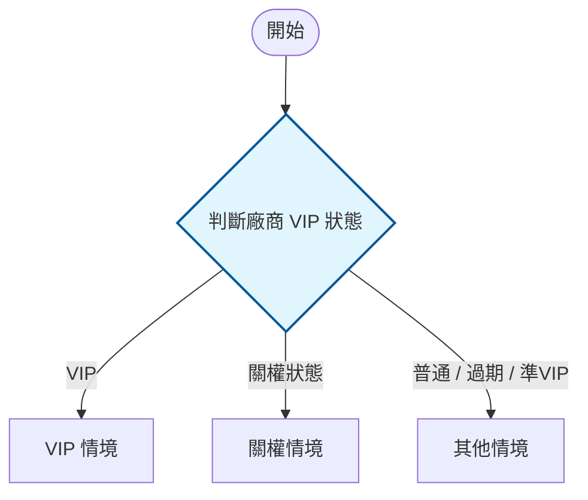

<!--markdownlint-disable MD033-->
<!--markdownlint-disable MD013-->

# 流程圖：HackMD 原生 mermaid

> 回 [`../SKILL.md`](../SKILL.md)。

規格書的流程圖一律用 HackMD 內建的 mermaid 渲染（HackMD 對 mermaid 支援穩定），**不要改用外掛或圖片**。
固定用 `flowchart TD`，並用 `classDef` 上色、`subgraph` 分情境：

````markdown

````

**配色慣例**：

| classDef | 用途 | 色系 |
| :--- | :--- | :--- |
| `condition` | 判斷節點 | 淺藍 |
| `action` | 動作節點 | 淺綠 |
| `alert` | 錯誤／disabled | 淺紅 |
| `block` | 情境群組（`subgraph`）| 灰底虛線框 |

流程圖通常放在對應章節末尾，標題如 `### 2 刊登狀態流程圖`。

> 循序圖（sequence diagram）不受此限——跨系統時序用 `sequenceDiagram`，
> 可參考 `career/portfolio/e1-cross-system-messaging.md` 的實例（`box` 分系統、`rect` 分階段、`autonumber`）。
