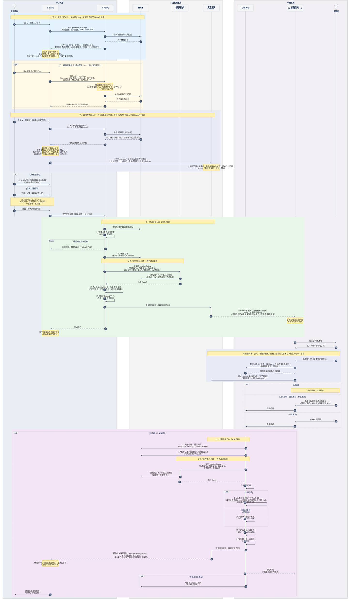

<!--markdownlint-disable MD033-->
<!--markdownlint-disable MD013-->
<!--
作品集 CASE STUDY — E.1 跨系統聯絡人才（信件即時通整併）
來源：本人統整之 Task Summary（規格與 API 契約）＋ 本人繪製之跨系統循序圖。
⚠️ 對外引用務必抽象化：可述「跨系統即時訊息、整合兩條 legacy 通道、定案代碼衝突」，
   但勿外露內部 API 名／欄位名／權限代碼（1111 機密）。去識別化後再放公開作品集。
-->

# 跨系統聯絡人才：把 8+ 份異質規格收斂為單一事實來源，定案 3 處長期未決的業務代碼衝突

Cross-system messaging (E.1): converged 8+ heterogeneous specs into a single source of truth and arbitrated 3 long-unresolved business-code conflicts.

**角色 / Role**：主導 PM／系統分析（單一 PM 定義整體架構）｜ **時間 / Timeline**：〔待補：起訖 YYYY/MM–MM〕｜ **團隊 / Team**：PM 1（本人）＋ 前端（Nuxt 4）／後端（.NET Core）／RD（SignalR 即時推播）跨團隊協作

---

## 1. 問題 / 背景　Problem & Context

1111 人力銀行的求才（廠商 B 端）與求職主網（求職者 C 端）是兩套獨立系統，廠商與求職者的往來訊息長期分散在**兩條 legacy 通道**——**站內信**與**即時通**——彼此不同步，體驗割裂。E.1「聯絡人才」要把兩條通道整併成**單一對話流**，讓雙方能在同一介面收發一般訊息與**五種邀約卡片**（詢問意願／面試邀約／面試異動／取消面試／錄取通知／感謝函），並**雙向即時同步**。

真正的難點不在畫面，而在**上游的規格治理**：功能相關資訊散落在 **8+ 份異質、且彼此不一致**的來源，其中**三處業務代碼衝突**被標記「待確認」已久，RD 無法安全落地。此專案橫跨前端 component、後端 API、SignalR 即時推播、EventBus 記訊整併、跨系統 E-mail 排程與資料庫對話紀錄——是我至今**技術範圍最廣**的單一專案。

## 2. 研究與洞察　Research & Insight

- **素材 / Artifacts**：3 份 HackMD 規格書（E.1 主規格／訊息樣式／跨系統流程）、4 份後端 API 契約 PDF、1 份前端 component 展示站（.mhtml 快照）、工程端循序圖、多張介面截圖。
- **方法**：以前端狀態機（`chatMessageMapper`／`toMailType`／`toInterviewStatus`／卡片渲染矩陣）**反推**前端「實際依賴」哪些欄位，再對照後端「實際提供」的欄位。
- **關鍵洞察 / Key insight**：真正的契約其實藏在前端而非規格書——前端會**衍生**後端根本不存在的代碼（如 `詢問意願` 的 `mailType=2` 為前端 mapper 衍生值）。若只讀規格、不讀狀態機，落地必然對不上。這個洞察直接催生了後續的 Gap Analysis 與代碼定案。

## 3. 方法與取捨　Approach & Trade-offs

- **建立單一事實來源（single source of truth）**：把分散、互斥的資訊收斂為一致知識庫，並立下鐵律——「同一支 API 一律參照權威文件、**不憑記憶**」。
- **API 契約文件化（4 支）**：`get-echat-mail-logs`（聊天列表）、`get-detail/{infoNo}`（單筆明細）、`get-by-condition`（條件搜尋）、`update-chatlog`（記訊整併同步），逐一整理端點／Header／Query／Body／回傳 JSON／欄位語意表／狀態碼。
- **前後端契約落差盤點（Gap Analysis）**：標出**後端尚未提供**（列表 `unread`／`mailType`／`isPinned`）與**前端衍生碼**，讓交接無歧義。
- **仲裁並定案 3 處長期未決代碼衝突**：
  1. `詢問意願` ＝ `type1 & interViewKind0`（`Type:2` 是前端衍生、後端無此碼）；
  2. `Type:8` 依 `interViewKind` 分流為**面試異動（1）／面試取消（3）**兩獨立結果；
  3. **收回**判定由 `revokeFlag` 改以 `sendKind∈{7,8}`。並釐清**兩層 mailType**（查詢參數層 vs jsonB 原始層）易混淆點、定案已讀未讀（`readflag`／`oViewDate`／`tViewDate`）與陌生訊息（`sendType`）判斷。
- **跨系統流程建模與修正**：把工程端技術循序圖整合為完整**業務循序圖（5 階段）**，並依領域知識修正正確性——權限／點數／履歷瀏覽數檢查**前移到寫 DB 之前**（失敗即擋住）、E-mail 改為「**加入寄信排程**」而非即時寄出、求職者一般訊息回覆改走各廠商帳號的「**收信區間排程**」、並在兩處「寫入信件主表」後補上 `update-chatlog` 整併同步。
- **取捨 / Trade-off**：既有的信件通知／封鎖／紀錄管理 lightbox 以 **iframe 串接現版**、而非重寫，換取**向後相容的漸進遷移**，把第一階段風險與工時壓到最低（批次操作、邀約收回等留待第二階段）。

## 4. 結果與學習　Results & Learnings

- **量化成果 / Outcomes**：
  - 統整 **8+ 份異質來源**為單一一致知識庫；
  - 文件化 **4 支後端 API ＋ 1 套前端狀態機契約**；
  - 仲裁並定案 **3 處**長期未決的業務代碼衝突；
  - 建構含 **5 大階段**、涵蓋前端／後端／DB／即時推播／排程的完整跨系統流程模型（見下圖）；
  - 商業成效（採用率／客戶留存）〔待補數據〕——功能級指標尚未到手。
- **誠實的迭代 / What didn't work**：初期曾憑既有印象假設代碼語意，導致前後端對不上；正是這個踩坑逼出「**永不憑記憶、一律引用權威文件**」的鐵律與整套 Gap Analysis——比起一次到位，這是本專案最實在的收穫。
- **知識治理 / Knowledge ops**：另建 wiki 路由表與輕量全局索引，依任務類型**動態載入**知識以節省 context，並訂立「E.1 需求一律 inference based on 素材集」的推導規則。
- **下次會做得更好 / What I'd do differently**：更早介入拿到功能級成效埋點，讓「規格品質」能連到「商業結果」而非停在交付品質。

---

## 🖼️ 核心交付物 — 跨系統業務循序圖 / Cross-system business sequence diagram

> 本人繪製。五階段：載入聊天列表 → 搜尋篩選 → 進聊天室建立 SignalR 連線 → 共同發送行為（求才系統）→ 共同回覆行為（求職系統）。

---

## 展現的職能 / Competencies demonstrated

- **產品規格撰寫**：跨系統功能規格、狀態機、MECE 狀態表、雙視角（廠商／求職者）互動規則。
- **系統分析／API 契約設計**：REST 端點與欄位語意文件化、前後端契約落差盤點、資料整併（合併去重、單一視圖）建模。
- **業務邏輯釐清**：代碼衝突仲裁、跨資料表整併語意、已讀未讀／陌生訊息／收回等邊界條件定義。
- **流程建模**：循序圖／流程圖、跨系統收發時序、非同步排程與即時推播（SignalR／WebSocket、EventBus）流程。
- **技術理解**：Nuxt 4 前端、.NET Core API、SignalR、EventBus、E-mail 排程、bit-flag／enum 業務代碼。
- **知識治理／文件工程**：single source of truth 建立、RAG 索引、版本控制、跨平台（HackMD／GitHub）同步。
- **跨角色協作**：辨識需向 PM／RD 確認的未定案項並明確標記，而非臆測。

> 履歷只放「一行 + 量化結果 + [見作品集案例]」；完整過程與圖留在本頁。對外公開版本請先去識別化內部 API／欄位／代碼名稱。
