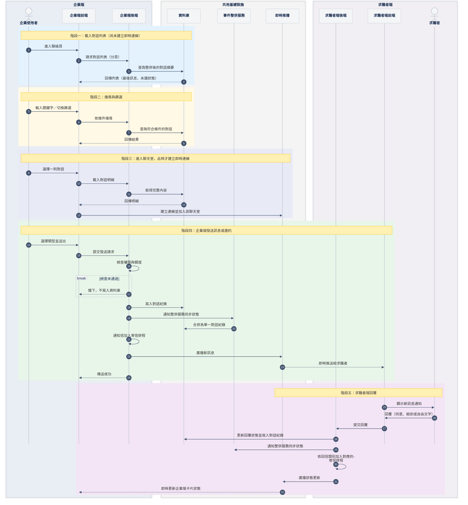

# 跨系統聯絡人才：把 8 份以上互相矛盾的規格，收斂成單一事實來源

Cross-system messaging: converged 8+ inconsistent specs into a single source of truth and resolved 3 long-open business-rule conflicts.

**角色**：主導 PM／系統分析（由我一人定義整體架構）｜ **時程**：2026 年，進行中｜ **團隊**：PM 1 人（我）＋ 前端、後端、即時推播（RD）跨團隊協作

---

## 1. 問題與背景

某大型求職平台有兩套獨立系統：企業端（B 端）與求職者端（C 端）。企業與求職者之間的往來訊息，長期分散在**兩條舊通道**——站內信與即時通——彼此不同步，體驗割裂。

這個專案要把兩條通道整併成**單一對話流**：雙方在同一個介面收發一般訊息與多種邀約卡片（詢問意願、面試邀約、面試異動、取消面試、錄取通知、感謝函），並且**雙向即時同步**。

這個痛點多年來持續從業務與客戶端反映，卻一直沒有排上優先序；直到 2026 年才正式立案，由我主導定義整體架構。真正的難點不在畫面，而在**上游的規格治理**：相關資訊散落在 8 份以上、且彼此不一致的來源，其中有三處業務規則的衝突被標記「待確認」已久，工程端無法安全落地。專案橫跨前端元件、後端 API、即時推播、跨系統事件整併、Email 排程與對話紀錄資料庫，是我至今技術範圍最廣的單一專案。

## 2. 研究與洞察

- **素材**：3 份功能規格書、4 份後端 API 契約文件、1 份前端元件展示頁、工程端循序圖與多張介面截圖。
- **方法**：從前端的狀態機反推它「實際依賴」哪些資料，再對照後端「實際提供」哪些資料。
- **關鍵洞察**：真正的契約其實藏在前端，而不在規格書裡。前端會自行**衍生**出後端根本不存在的狀態值；只讀規格、不讀狀態機，落地時前後端必然對不上。這個洞察直接催生了後面的落差分析與規則定案。

## 3. 方法與取捨

- **建立單一事實來源**：把分散、互斥的資訊收斂成一致的知識庫，並立下鐵律：同一支 API 一律以權威文件為準，不憑記憶。
- **API 契約文件化（4 支）**：聊天列表、單筆明細、條件搜尋、訊息整併同步。逐一整理請求、回傳、欄位語意與錯誤情境。
- **前後端落差盤點**：標出後端尚未提供的欄位與前端衍生的狀態值，讓交接不留模糊地帶。
- **仲裁並定案 3 處長期未決的規則衝突**：
  1. 「詢問意願」這類訊息的判定：前後端對同一種訊息的分類方式不一致，定案以後端實際資料為準，前端衍生值另外標註。
  2. 同一個事件依情境應拆成「面試異動」與「面試取消」兩種獨立結果，而不是共用同一種狀態。
  3. 「訊息收回」的判定改依發送類型，而不是原本容易失真的旗標欄位。
- **同時釐清**：已讀未讀的判斷方式，以及陌生訊息（求職者先發起）的識別方式。
- **跨系統流程建模**：把工程端的技術循序圖，整合成涵蓋 5 個階段的業務循序圖，並依領域知識修正三處正確性問題：
  - 權限與額度檢查**前移到寫入資料庫之前**，失敗就擋下，不留髒資料；
  - 通知信改為**加入寄信排程**，而不是即時寄出；
  - 求職者回覆的一般訊息，改走各企業帳號自己的**收信區間排程**。
- **取捨**：既有的通知設定與紀錄管理頁面，以嵌入現版畫面的方式串接，而不重寫，換取**向後相容的漸進遷移**，把第一階段的風險與工時壓到最低；批次操作、邀約收回等留待第二階段。

## 4. 結果與學習

- **產出**：
  - 統整 8 份以上互相矛盾的來源，成為單一一致的知識庫；
  - 文件化 4 支後端 API 與 1 套前端狀態機契約；
  - 仲裁並定案 3 處長期未決的業務規則衝突；
  - 建立涵蓋前端、後端、資料庫、即時推播與排程的 5 階段跨系統流程模型（見下圖）。
- **做錯過的事**：初期我曾憑既有印象假設各狀態值的語意，導致前後端對不上。這次踩坑逼出「不憑記憶、一律引用權威文件」的鐵律與整套落差分析，比起一次到位，這是這個專案最實在的收穫。
- **下次會更早做**：更早介入拿到功能層級的成效埋點，讓「規格品質」能連到「商業結果」，而不是只停在交付品質。

---

## 核心交付物：跨系統業務循序圖（抽象版）

五個階段：載入對話列表 → 搜尋與篩選 → 進入聊天室並建立即時連線 → 企業端發送 → 求職者端回覆。

---

## 展現的能力

- **產品規格撰寫**：跨系統功能規格、狀態機、雙視角（企業端與求職者端）互動規則。
- **系統分析與 API 契約設計**：端點與欄位語意文件化、前後端契約落差盤點、資料整併建模。
- **業務邏輯釐清**：規則衝突仲裁、已讀未讀與陌生訊息等邊界條件定義。
- **流程建模**：循序圖、跨系統收發時序、非同步排程與即時推播。
- **跨角色協作**：辨識必須向 PM 與工程端確認的未定案項目並明確標記，而非臆測。
