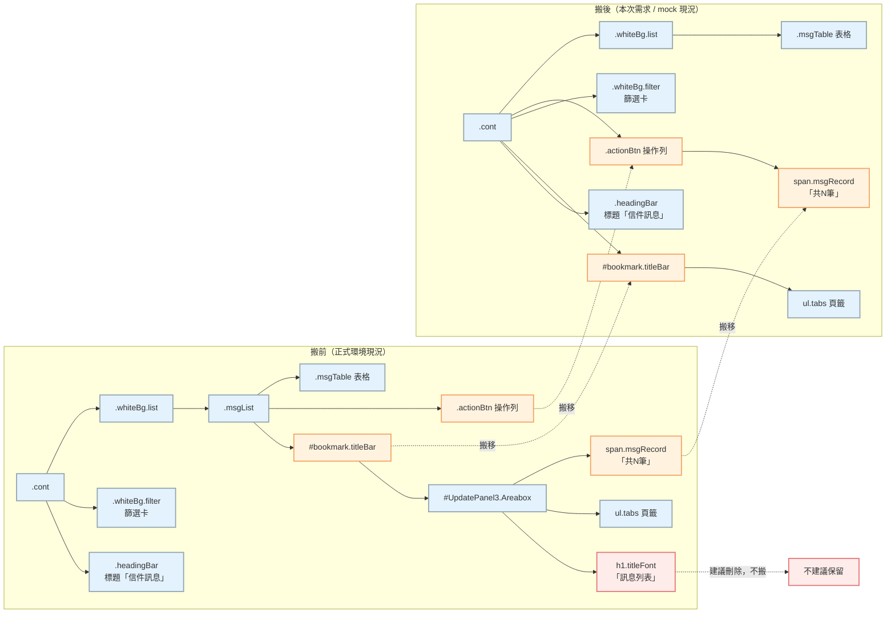

<!--markdownlint-disable MD033-->
<!--markdownlint-disable MD013-->

# 信件訊息列表調整需求

* User Story: 無
* 對應規格：本文件章節編號**對齊**《[4.1 信件訊息列表規格文件](/rJkyKgeGWl)》（信件列表 規格文件）的功能區塊（`1 Heading與篩選區`／`2 信件列表`／`3 信件對話`），方便與規格逐塊對照。

:::spoiler Document info

文件版本：v0.3.0
最後更新：2026/07/01
文件作者：UIUX
文件狀態： 草稿</h6>
功能位置：
<https://recruit.1111.com.tw/.../ResumePoolNoticeMail.aspx>

## 版控紀錄

| 版本 | 日期 | 作者 | 調整說明（異動區段 + 內容摘要） |
| :---: | :--- | :--- | :--- |
| 0.1.0 | 2026-06-23 | UIUX | 初版：彙整信件訊息頁前端視覺調整需求，逐一列出每個 HTML 標籤的更動與對應 CSS 檔名/行數 |
| 0.2.0 | 2026-06-29 | UIUX | [全文] 依《4.1 信件訊息列表規格文件》(`rJkyKgeGWl`) 的功能區塊重排章節編號（1／2／3）；新增「區塊對照索引」與「對不到單一區塊」清單；各需求內容不變 |
| 0.2.1 | 2026-06-30 | UIUX | [示意圖] 新增「調整前頁面區塊標號」截圖（GitHub raw 引用，badge 對應規格區塊 1／2.1／2.2／2.3／3） |
| 0.2.2 | 2026-06-30 | UIUX | [各章節] 內嵌各區塊「調整前」局部標號圖（1／2.1／2.2／2.3／3）於對應章節 |
| 0.3.0 | 2026-07-01 | UIUX | [全文] 解耦合重寫：把「多個標籤擠在同一張表格」的段落拆成一個標籤一段白話敘述（表格只留給版控/附錄/區塊索引與 X1 這類本來就是打底規則的地方）；新增「結構調整總覽」，用搬移前後 Mermaid 對照圖把 titleBar／actionBtn／msgRecord 搬移與 h1.titleFont 刪除講清楚，取代原本開放式提問；新增 X3（篩選/輸入元件外觀統一）、X4（段落預設間距重置）；2.4 拆出表頭圓角併入 3.7 |

[TOC]

:::

## 閱讀方式（給工程師）

1. 本文件**章節編號已對齊規格文件**《4.1 信件訊息列表規格文件》：`1 Heading與篩選區`、`2 信件列表`（`2.1 Tab`／`2.2 操作列`／`2.3 下拉篩選選單`）、`3 信件對話`（`3.1`～`3.6`）。每個視覺需求掛在它所屬的規格區塊下。
2. **一個小節只對應一個 HTML 標籤／元素**，用白話一段話講清楚要改成什麼樣子，不用表格條列硬湊。表格只留給：版控紀錄、附錄「CSS 行號速查」、「區塊對照索引」，以及少數本來就是「同一條規則、同時套用到一大群元素」的打底規則（如 X1 全站字級放大、X3 輸入元件外觀統一的共用邊框）。每節標題後以「（原 §N）」標示對應到舊版（v0.1.0，依 HTML 元素排序）的章節，方便回溯。
3. **涉及「把某個標籤從一個 div 搬到另一個 div」的需求**，集中寫在最前面「結構調整總覽」，附搬移前後對照圖；各章節只放連結指回去，不重複敘述、也不留開放式問題。
4. CSS 檔名統一為 **`resumePoolNoticeMail.css`**；所附行號為**隨附 mock 檔**的行號（共 1706 行版本），正式 codebase 行號請依 selector 對應。
5. 值一律以反引號標出（如 `#1a66ff`、`16px`）。涉及 HTML 結構/屬性的更動另以 🔧 標明。
6. 標 紅字 者為需特別注意之結構前提或與正式環境不一致處。
7. **跨多個區塊、無法歸入單一規格區塊**的調整（如全頁字級放大、輸入元件外觀統一、段落間距重置、離線替身排除），集中放在文末「跨區／共用調整」一節（X1～X4）。

---

## 區塊對照索引

> 把本次視覺需求對映到《4.1 信件訊息列表規格文件》(`rJkyKgeGWl`) 的區塊；最後一欄為舊版（v0.1.0）章節號。

| 參考文件區塊（`rJkyKgeGWl`） | 本文件對應小節 | 舊 § |
| :--- | :--- | :--- |
| 初始化（入口／保存方式／職缺刪除情境） | —（本次**無視覺調整**，沿用原規格） | — |
| **1 Heading與篩選區** | 1.1 標題列 | §1 |
| 　〃（與 2.1 交界） | 1.2 頁籤容器＋篩選卡合併便當 | §3 |
| **2 信件列表** | 2.4 卡片容器 `.whiteBg.list` | §7 |
| **2.1 Tab** | 2.1 底線式 Tab | §2 |
| **2.2 操作列** | 2.2.1 批次按鈕 | §5 |
| 　〃 | 2.2.2 訊息筆數「共 N 筆」 | §4 |
| 　〃（＋3.1.1） | 2.2.3 Checkbox 互動（全選/半選/條件顯示） | §13 |
| **2.3 下拉篩選選單** | 樣式併入 X3（信件類別/求職者回覆下拉） | §6（部分） |
| **3 信件對話**（表頭與列） | 3.7 表頭列 `.thead .tr` | §8 |
| 　〃 | 3.8 資料列 hover `.mDetailA` | §9 |
| **3.1 操作項目** | Checkbox 行為見 2.2.3；星號無視覺調整 | §13（部分） |
| **3.2 求職者姓名** | 僅字級放大（見 X1） | §12（部分） |
| **3.3 求職者回覆狀態** | 3.3 回覆狀態欄（含意願） | §11 |
| **3.4 信件內容** | 3.4 訊息內容欄 `.td-mail` | §10 |
| **3.5 邀約職缺** | 僅字級放大（見 X1） | §12（部分） |
| **3.6 最新發信日期** | 僅字級放大（見 X1） | §12（部分） |
| 輸入/下拉元件外觀（跨 1/2.2/2.3） | X3 篩選/操作輸入元件外觀統一 | §6 |
| 段落預設間距（跨 3.3／3.4／3.5） | X4 段落預設間距重置 | （新拆出） |

### 對不到單一區塊（跨區／meta，集中於文末）

| 舊 § | 項目 | 為何對不到 → 處置 |
| :--- | :--- | :--- |
| §6 | 篩選輸入框/下拉統一邊框、hover、focus | 一次套用到 1 區 5 個元件 + 2.3 區 2 個下拉，跨兩個規格區塊、非單一標籤 → 列為 **X3 輸入元件外觀統一** |
| §12 | 一般內容文字放大 `16px` | 一次套用到 1/2/3 多個欄位（頁籤、篩選、表頭、姓名、回覆狀態、信件內容、職缺、日期、分頁），非單一區塊 → 列為 **X1 跨區字級** |
| §14 | 不需處理／排除項目（離線替身、mock 補值） | 屬交付說明（meta），不對應任何畫面區塊 → 列為 **X2 排除項目** |
| （新拆出） | `.msgTable p` 段落預設 margin 清零 | 一次套用到 3.3/3.4/3.5 底下好幾種 `
`，非單一標籤 → 列為 **X4 段落預設間距重置** |

---

## 示意圖：調整前頁面區塊標號

> 下圖為**調整前**現況頁面，依本文件區塊編號標注 badge（對應規格《[4.1 信件訊息列表規格文件](/rJkyKgeGWl)》的功能區塊）。badge 為紅底編號，打在畫面左側留白、不遮畫面內容。

badge 對照：`1` Heading與篩選區｜`2.1` Tab｜`2.2` 操作列｜`2.3` 下拉篩選選單｜`3` 信件對話。（`2 信件列表` ＝ 2.1～2.3 的容器，未單獨標。）

---

## 結構調整總覽（正式環境 DOM 需搬動的地方）

> mock 跟正式環境目前有 3 個元素位置不一樣，另外還有 1 個節點被拿掉。這些搬動**不是 mock 亂改**，是要達成本次視覺需求（頁籤跟篩選合併同一張卡、操作列要顯示在篩選卡跟表格中間）才需要動；下面直接講清楚怎麼搬，不留開放式問題。左邊是正式環境現在的樣子，右邊是搬完後要達成的樣子（＝ mock 現況）：

**要搬的 3 個地方**：

1. `#bookmark.titleBar`（頁籤區塊，含 `ul.tabs`）：從 `.whiteBg.list > .msgList` 裡面搬出來，移到 `.cont` 最上層、緊接在 `.whiteBg.filter` 正上方。目的：讓頁籤跟篩選卡變成相鄰的 sibling，才能只靠 CSS 合併成同一張便當（見 [1.2](#12-頁籤列-bookmarktitlebar-與篩選卡-whitebgfilter-合併為同一張便當原-3)）。
2. `.actionBtn`（操作列，含批次按鈕跟下拉）：從 `.msgList` 裡面搬出來，移到 `.whiteBg.filter` 跟 `.whiteBg.list` 中間（見 [2.2](#22-操作列)）。
3. `span.msgRecord`「共 N 筆」：從頁籤區塊內的 `#UpdatePanel3.Areabox` 搬到 `.actionBtn` 裡面（放最前面），跟批次按鈕同一列顯示（見 [2.2.2](#222-訊息筆數-span-classmsgrecord「共-n-筆」原-4)）。

**建議刪除，不用搬**：`h1.titleFont`「訊息列表」這個子標題。頁面主標「信件訊息」（1.1）已經講過同樣的意思，設計稿上也沒有再顯示這行字，建議直接刪掉。

**其餘結構差異不用管**：`data-*`／`onclick` 屬性、隱藏欄位（`input[type=hidden]`）、操作指引浮層 `#guidedTour`——這些是 mock 為了離線預覽精簡掉的，不是視覺需求的一部分，正式環境維持原樣即可，不用比照 mock 拿掉。頁籤末兩項順序對調也是 mock 偏離，不是需求，見 [2.1](#21-tab-ul-classtabs--li-classtab底線式-tab原-2) 的紅字提醒。

---

## 1 Heading與篩選區

> 篩選欄位本身（職缺、日期、關鍵字、搜尋鈕）的邊框/hover/focus 外觀，統一寫在文末 [X3](#x3-篩選操作輸入元件外觀統一原-6)，這裡不重複。

### 1.1 標題列 `<h2 class="Title">`（「信件訊息」）（原 §1）

把頁面大標「信件訊息」換成設計系統的標題級距。

* **要改成**：`font-family:"Microsoft JhengHei","微軟正黑體","新微軟正黑體",sans-serif; font-weight:500; font-size:28px; line-height:150%; color:#212529`
* **原本**：`color:#4e4e4e; font-size:20px`（沒指定字重/行高/字體）
* **改哪**：`resumePoolNoticeMail.css` 第 1686–1693 行（新增 `.headingBar .Title` override）
* **HTML**：不用動。

### 1.2 頁籤列 `#bookmark.titleBar` 與篩選卡 `.whiteBg.filter` 合併為同一張便當（原 §3）

把頁籤列和下方的篩選欄位視覺上做成**同一張圓角白卡**：頁籤在上、篩選在下，中間一條 `#e9ecef` 細線分隔，整張卡共用一圈陰影跟便當同款圓角 `10px`，左右留白對齊便當的 `32px`。

* **要改成**：
  - `#bookmark.titleBar`（便當上半）：`background:#fff; border-radius:10px 10px 0 0; box-shadow:0 3px 6px rgba(0,0,0,.15); z-index:1`
  - `.whiteBg.filter`（便當下半）：`border-radius:0 0 10px 10px; margin-top:0; z-index:2`（不透明白底蓋住接縫陰影）
* **原本**：兩者各自獨立一張卡（各自四角圓角、各自陰影、中間有明顯間距）。
* **改哪**：`resumePoolNoticeMail.css` 第 1640–1645 行（titleBar）、第 1647–1650 行（filter）。
* **HTML**：🔧 要動。正式環境的 `#bookmark.titleBar` 現在包在 `.whiteBg.list > .msgList` 裡面，跟 `.whiteBg.filter` 不相鄰，沒辦法只靠 CSS 合併成一張卡。**請把整塊 `#bookmark.titleBar`（連同裡面的 `ul.tabs`）從 `.msgList` 搬出來，移到 `.cont` 最上層、緊接在 `.whiteBg.filter` 正上方**，讓兩者變成相鄰的 sibling。完整搬移範圍（含另外兩個一起搬的區塊）見前面「[結構調整總覽](#結構調整總覽正式環境-dom-需搬動的地方)」。

---

## 2 信件列表

> 對應規格 `2 信件列表`。以下 2.1～2.3 對齊規格的 Tab／操作列／下拉篩選；2.4 為承載整個列表的卡片容器樣式。

### 2.1 Tab `<ul class="tabs"> / <li class="tab">`（底線式 Tab）（原 §2）

HTML **不用動**（底線用 `li.active::after` 偽元素做出來，沒有新增節點）。把原本「膠囊/方塊式」頁籤改成「底線式 Tab」：

* 沒選中時：灰字 `#212529`、字重 `400`、`16px`、行高 `1.55`，透明底、無框，`padding:8px 0 16px`。
* 滑鼠移過去（hover）：字色轉品牌藍 `#1a66ff`，不加底線、字重不變。
* 選中（active）：字色 `#1a66ff`、字重加粗到 `500`；底下畫一條 4px 藍色底線（`::after` 偽元素），上緣圓角 `80px`。
* 容器 `.tabs`：改成 `display:flex; justify-content:flex-start; gap:32px`，底部一條 `#e9ecef` 分隔線，`padding:16px 32px 0`（移除原本的 `list-style`/`margin`）。

* **改哪**：`resumePoolNoticeMail.css` 第 1634–1678 行（容器 1652、預設 1661、hover 1669、選中 1670、底線 1674）。舊的膠囊規則（第 1067–1106 行及像素取樣覆蓋 1362/1364/1402–1416/1504/1529）與本區塊的 `!important` 在正式整併時可一併刪除。
* 🚧 頁籤順序（全部/未讀/已讀/已加星號/有意願）以正式環境規格 2.1.1～2.1.5 為準；mock 末兩項順序對調，屬 mock 偏離，不是需求，不要照抄。

### 2.2 操作列

> 對應規格 `2.2 操作列`。🔧 正式環境這整列（`.actionBtn`）目前包在 `.msgList` 裡面；本次需求要它顯示在篩選卡跟表格中間，**請把 `.actionBtn` 搬到 `.whiteBg.filter` 跟 `.whiteBg.list` 之間**，詳見「[結構調整總覽](#結構調整總覽正式環境-dom-需搬動的地方)」。本區三項：批次按鈕（2.2.1）、訊息筆數（2.2.2）、Checkbox 互動行為（2.2.3）。

#### 2.2.1 批次按鈕：刪除 / 移除星號 / 已讀勾選訊息（原 §5）

三顆按鈕共用同一組尺寸與顯示規則：固定寬改自然寬（`width:auto; padding:0 14px`），文字跟 hover 都置中（`display:inline-flex; align-items:center; justify-content:center; height:25px`）；**預設全部隱藏**，等使用者勾選任一列 checkbox 後才顯示（見 2.2.3 的 `has-checked` 規則）。這組共用規則改哪：`resumePoolNoticeMail.css` 第 1508–1517、1619 行（尺寸置中）、第 1628 行（預設隱藏）、第 1631 行（勾選後顯示）。

個別差異只有圖示跟顏色：

* `.deleteBtn > a`（刪除）：🔧 把裡面的 `<i class="far fa-trash-alt">` 拿掉，按鈕只留文字「刪除」。顏色維持原值 `#e25656`（hover `#FFEAEB`），不用改。
* `.starBtn > a`（移除星號）：🔧 把裡面的 `<i class="far fa-star">` 拿掉，按鈕只留文字「移除星號」。顏色維持原值 `#199ed8`（hover `#e9f8ff`），不用改。
* `.readBtn > a`（已讀勾選訊息）：本來就沒有 icon，不用動。顏色維持原值 `#199ed8`（hover `#e9f8ff`）。

#### 2.2.2 訊息筆數 ``（「共 N 筆」）（原 §4）

把「共 N 筆」文字套用內文字級：`Noto Sans TC`、字重 `400`、`16px`、行高 `155%`（約 25px）、字色 `#495057`，並用 `display:inline-flex; align-items:center` 讓它跟旁邊按鈕垂直對齊。

* **改哪**：`resumePoolNoticeMail.css` 第 1696–1705 行（新增 `.actionBtn .msgRecord` override）；原本是 `14px`（在第 1554 行那組）。
* **HTML**：🔧 要動。正式環境 `span.msgRecord` 現在放在頁籤區塊（`#UpdatePanel3.Areabox`）裡面；本次需求要它跟批次按鈕同一列顯示，**請把它搬到 `.actionBtn` 裡面**（放最前面即可）。搬移對照見「[結構調整總覽](#結構調整總覽正式環境-dom-需搬動的地方)」。

#### 2.2.3 Checkbox 互動 `#checkALL` / `input[name="mainNo"]`（行為規格，原 §13）

這兩個 checkbox 的行為互相牽動，一起講：

* 表頭 `#checkALL` 被勾選／取消時，底下**所有列**的 `input[name="mainNo"]` 跟著全選／全不選。
* 任一列的 `input[name="mainNo"]` 被勾／取消時，反過來同步表頭 `#checkALL` 的**半選狀態**（`indeterminate`）。
* 只要有任一列被勾選，就在 `.actionBtn` 加上 class `has-checked`，讓三顆批次按鈕顯示出來（一顆都沒勾就拿掉這個 class，按鈕收回去）。

實作方式（jQuery／原生 JS）由工程師決定，這裡只規定行為；CSS 端已經對應好 `.actionBtn.has-checked` 這個 state class（見 2.2.1）。同時也對應規格 `3.1.1 Checkbox`（列上的勾選框）。

### 2.3 下拉篩選選單（信件類別 `#ddlMailType` / 求職者回覆 `#ddlReaded`）

這兩個下拉本次**只統一外框/hover/focus 外觀**，跟 1 區的篩選輸入框是同一組規則，寫在文末 [X3](#x3-篩選操作輸入元件外觀統一原-6)，這裡不重複。下拉本身的**篩選邏輯與選項值**（信件類別 value、面試類別、求職者回覆 value）不在本次視覺需求範圍內，沿用規格 2.3.1～2.3.3。

### 2.4 卡片容器 `.whiteBg.list`（原 §7）

承載整個「2 信件列表」的白色圓角卡片，留白微調：

* 內距（padding）從四邊 `20px 24px 20px 24px` 改成 `0 0 20px 0`——上面跟左右的內距拿掉，讓表格貼齊卡片邊，只留下方 `20px`（沿用原本的 bottom 值），分頁才不會貼卡片底部。
* 下外距（margin-bottom）從 `20px` 改 `0`。

* **改哪**：`resumePoolNoticeMail.css` 第 1428 行（padding）、第 1565 行（margin-bottom）。
* **HTML**：不用動。

> 表頭列的頂角圓角（配合卡片圓角）併在 [3.7](#37-表頭列-msgtable-thead-tr含-th原-8) 一起講，這裡不重複。

---

## 3 信件對話 by 職缺&求職者

> 對應規格 `3 信件對話`（列表中的每一列＝一則對話）。規格 3.1～3.6 以「列內欄位」拆分；本次視覺需求落在 3.3（回覆狀態）、3.4（信件內容），以及表格整體的表頭/列樣式（3.7／3.8，規格未細分，另立於此）。3.1 操作項目的 Checkbox 行為見 2.2.3。

### 3.1 操作項目（Checkbox／星號）

* **3.1.1 Checkbox**：勾選互動行為見 [2.2.3](#223-checkbox-互動-checkall--inputnamemainno行為規格原-13)。
* **3.1.2 星號**：本次**無視覺調整**（維持原樣）。

### 3.2 求職者姓名 `.tName`

* 本次僅隨「一般內容文字放大」調為 `16px`（見 [X1](#x1-一般內容文字放大-16px排除中間操作項目原-12)），無其他視覺調整。

### 3.3 回覆狀態欄 `.td-status`（含意願）（原 §11）

「無意願」文字色由 `#BF1212` 改為 `#FF5D15`；「有意願」維持 `#1D880D`。

* **改哪**：`resumePoolNoticeMail.css` 第 983 行（`.msgTable .td-status .isNoWish{color:#FF5D15}`）；有意願第 980 行（`.isWish #1D880D`）。
* **HTML**：不用動。

> 🚧 **結構說明（重要）**：正式環境的「有意願/無意願」是放在 `.td-status` 內、以獨立節點 `p.wish-content.isWish` / `p.wish-content.isNoWish` 呈現（與 `p.reply-content` 以 `•` 分隔，例：`已回覆 • 無意願`）。本需求的 `#FF5D15` 即套在 `.isNoWish`，**正式環境請以此為準**。
>
> 註：規格 3.3 原訂「無意願」`#BF1212`，本次依設計調整為 `#FF5D15`，其餘狀態（未回覆 `#666666`、已回覆 `#000000`、有意願 `#1D880D`）沿用規格。
> mock 畫面上的「無意願」原為前一手改寫到 `.td-mail > p.mail-type` 的 inline 上色（偏離正式結構），**現已修正回 `.td-status` 的 `wish-content` 結構**，正式環境請勿沿用舊 mock 的 inline 寫法。來源：`01_HTML結構調整對照.md` §2.5 D。
> 另：未讀紅點 `--State-warning #BF1212`（badge）為不同語意，**不更動**。

### 3.4 信件內容 `.td-mail`（`p.mail-type` / `bdi` / `span.badge`）（原 §10）

對應規格 `3.4 信件內容`（3.4.1 信件類別＝`p.mail-type`／3.4.2 訊息內容預覽＝`bdi`）。

* `bdi`（內容預覽文字）：跟上面類別文字的間距從 `3px 0 0 0` 收斂為 `2px 0 0 0`。**改哪**：第 1386 行。
* `span.badge`（未讀紅點）：從 `6px×6px` 放大成 `10px×10px`。**改哪**：第 1496 行。連帶讓有紅點的那一列，內容文字的可用寬度要扣掉紅點變大的差額，`.td-mail:has(.badge)` 內文寬度公式改成 `max-width:calc(100% - 12px - 18px - 10px)`（原本扣 `6px`）。**改哪**：第 1497 行。
* `p.mail-type`、`p.wish-content`/`p.reply-content`、`.job-content` 這幾個 `
` 的預設上下留白清零，是跨區塊的打底規則，見文末 [X4](#x4-段落預設間距重置-msgtable-p)，這裡不重複。
* **HTML**：不用動。

### 3.5 邀約職缺 `.job-content`

* 本次僅隨「一般內容文字放大」調為 `16px`（見 [X1](#x1-一般內容文字放大-16px排除中間操作項目原-12)），無其他視覺調整。

### 3.6 最新發信日期 `.td.w8`

* 本次僅隨「一般內容文字放大」調為 `16px`（見 [X1](#x1-一般內容文字放大-16px排除中間操作項目原-12)），無其他視覺調整。

### 3.7 表頭列 `.msgTable .thead .tr`（含 `.th`）（原 §8）

規格 3 是照欄位拆分的，沒有另外講表頭整體樣式，這裡把表頭列樣式集中講：

* 底色從 `#e5eaf3` 改成設計圖指定的淺藍 `#E3ECFD`。**改哪**：第 1388 行。
* 文字色改深藍 `#0D2760`（原本沒設定文字色、繼承深色），配合各 `.th` 既有的 `font-weight:bold`。**改哪**：同第 1388 行。
* 儲存格上下內距從 `10px` 加到 `12px`（左右維持 `15px` 不變），表頭列會略微加高。**改哪**：第 1682–1683 行。
* 頂角圓角配合卡片圓角，改成 `border-radius:10px 10px 0 0`（承接 [2.4](#24-卡片容器-whitebglist原-7) 的卡片圓角）。**改哪**：第 1429 行。

**HTML**：不用動。

### 3.8 資料列 `.msgTable .tr .mDetailA`（滑鼠移過去的 hover 效果）（原 §9）

對應規格 3「滑鼠進入時顯示為 hover 樣式」。原本 hover 是左右內陰影加外陰影邊框那種效果，改成單純換底色：滑鼠移過去該列變成淡紅底 `#FFF7F7`，不要邊框也不要陰影（`box-shadow:none`），滑鼠游標也要變成手指 `cursor:pointer`。

* **改哪**：`resumePoolNoticeMail.css` 第 921–927 行（直接改原本的 `:hover` 規則，把陰影拿掉、`z-index` 也一併移除）。
* **HTML**：不用動。

---

## 跨區／共用調整（對不到單一規格區塊）

> 以下四項一次作用於多個區塊或屬交付說明，無法歸入單一規格區塊，集中於此。

### X1 一般內容文字放大 `16px`（排除中間操作項目）（原 §12）

| 項目 | 內容 |
| :--- | :--- |
| 放大為 `16px` | `.tabs .tab`、`.headingBar .LMInstruct`、`.filterBox .LMVacancies`、`.filterBox input/.jobList/.searchName/.start/.end/.btnSch`、`.msgTable .thead .tr`、`.tName`、`.td-status .reply-content`、`.mail-type`、`.td-mail bdi`、`.job-content`、`.td.w8`(日期)、`.pageBox.DataPager` 及其 `a/.Currect/.dataPagerText/select/input` |
| 維持 `14px`（明確排除） | `.actionBtn` 與其 `.msgRecord`(見 2.2.2 已另調 16px)、三顆批次按鈕 `a`、`.otherAcc`、`.LMType select`、`.seekerWillStatus select` |
| 次要層級 | `.td-status .sub-read`（求職者已讀）`14px` |
| CSS 檔／行 | `resumePoolNoticeMail.css` L1529 起（16px 群組） |

### X2 不需處理 / 排除項目（原 §14）

| 項目 | 說明 |
| :--- | :--- |
| `body{background:#f0f0f0}`（L1316）、欄寬 `.w2/.w5/...` 與 `.w50 flex:1`（L1320） | **mock 補值**（原站定義在未打包的 `boxPage.css`、外層 layout 提供）；正式環境已具備，**無需處理** |
| FontAwesome CDN `@font-face`、三顆按鈕/星號/清除/箭頭等 inline SVG `data-uri`、`.icon-bulb` SVG 替身 | **離線預覽替身**（打包缺資產用），正式環境用站台原字型/圖示資產，**務必排除** |

### X3 篩選/操作輸入元件外觀統一（原 §6）

這 7 個輸入類元件（分屬 1 區、2.2 操作列、2.3 下拉篩選）本次統一外觀，共用同一組邊框規則，放在這裡一次講完，個別小地方不同的另外列出來：

**共用（7 個元件都套）**：預設 `border:1px solid #ccc; border-radius:4px; box-shadow:none; transition:border-color .15s`；滑鼠移過去（hover）`border-color:#9aa7b2`；點進去（focus / focus-within）`outline:none; border-color:#4f6b92`。**改哪**：第 1442 行起（預設）、第 1467 行（hover）、第 1477 行（focus）。

| selector | 屬於哪區 | 個別差異 | 改哪 |
| :--- | :--- | :--- | :--- |
| `#EmpInput.jobList`（職缺篩選輸入框） | 1 區 | 套共用規則，沒有其他調整 | — |
| `.LMDateSet .start` / `.end`（日期起訖範圍） | 1 區 | 外框改由外層 `.LMDateSet` 容器統一承接，裡面兩個 `input` 本身改 `border:none` | L1457 |
| `#txtSearchKeyWord.searchName`（關鍵字輸入框） | 1 區 | 右邊緊接搜尋鈕，右邊框跟右側圓角拿掉（`border-right:none; border-top/bottom-right-radius:0`），視覺上跟搜尋鈕接成一個輸入框 | L1448 |
| `#btnSearch.btnSch`（搜尋按鈕） | 1 區 | 左角 `0`、右角 `4px`，跟左側關鍵字框密接 | L1452 |
| `#txtChooseUNOs.otherAcc`（查看其他帳號） | 2.2 操作列 | 套共用規則，沒有其他調整 | — |
| `#ddlMailType`（信件類別下拉） | 2.3 | 套共用規則，沒有其他調整 | — |
| `#ddlReaded`（求職者回覆下拉） | 2.3 | 套共用規則，沒有其他調整 | — |

**HTML**：都不用動。

### X4 段落預設間距重置 `.msgTable p`

`.msgTable` 底下所有 `
`（`p.mail-type`、`p.wish-content`/`p.reply-content`、`.job-content` 這些）瀏覽器預設上下有 `16px 0` 的留白，全部清成 `margin:0`，改由各自元件自己控制間距，不要讓瀏覽器預設值造成多餘空隙。這是打底的技術性 reset，不是設計上特別要的視覺效果，牽動 3.3／3.4／3.5 好幾種 `
`，所以拆出來獨立講。

* **改哪**：`resumePoolNoticeMail.css` 第 1596 行。
* **HTML**：不用動。

---

## 附錄：CSS 行號對照（隨附 mock 檔 `resumePoolNoticeMail.css`，1706 行版）

| 區段 | selector | 行號 |
| :--- | :--- | :--- |
| 標題（1.1） | `.headingBar .Title` | 1686–1693 |
| 便當合併（1.2） | `#bookmark.titleBar` / `.whiteBg.filter` | 1640 / 1647 |
| 底線式 Tab（2.1） | `.tabs` / `.tab` / `:hover` / `.active` / `::after` | 1652 / 1661 / 1669 / 1670 / 1674 |
| 批次按鈕共用（2.2.1） | 自然寬/置中、隱藏、has-checked | 1508–1517、1619 / 1628 / 1631 |
| 筆數（2.2.2） | `.actionBtn .msgRecord` | 1696–1705 |
| 卡片（2.4） | `.whiteBg.list` padding / `.whiteBg` margin | 1428 / 1565 |
| 回覆狀態意願（3.3） | `.isNoWish` / `.isWish` | 983 / 980 |
| 信件內容（3.4） | `bdi` / `.badge` / `.td-mail:has(.badge)` | 1386 / 1496 / 1497 |
| 表頭（3.7） | 配色 / `.th` padding / 頂角圓角 | 1388 / 1682–1683 / 1429 |
| 資料列 hover（3.8） | `.mDetailA:hover` | 921–927 |
| 16px 群（X1） | 多 selector | 1529 起 |
| 輸入元件外觀（X3） | 預設 / searchName / btnSch / LMDateSet / hover / focus | 1442 / 1448 / 1452 / 1457 / 1467 / 1477 |
| 段落 margin reset（X4） | `.msgTable p` | 1596 |
