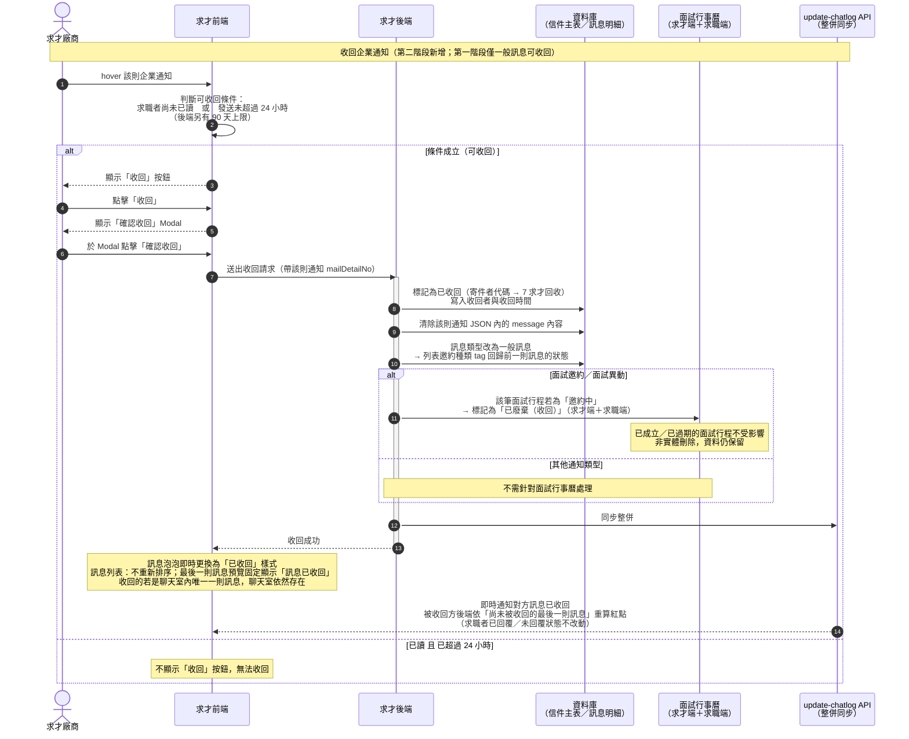

<!--markdownlint-disable MD033-->
<!--markdownlint-disable MD013-->

# 聯絡人才：第二階段內容

## 示意圖

## Topbar鈴鐺通知調整

全站右上角通知行為調整`待補`

## Heading調整

移除container外的返回操作，改為位於聯絡人才的標題的左側

---

## 1.1 篩選 Tab

頁面頂部提供下列 Tab，切換時重新篩選聊天列表並更新筆數：

| 每個 Tab 顯示為一個分頁 | 點擊切換時重新載入聊天列表 |
| --- | --- |
| `全部 (N)` | <ul><li>第一階段為`一般`，第二階段會改名</li><li>顯示除陌生訊息外的全部對話（已讀＆未讀）</li></ul> |
| `我的未讀訊息` | 僅顯示含未讀的對話 |
| `我的已讀訊息` | 僅顯示已讀的對話 |
| `有意願` | 顯示求職者回覆有意願的對話 |
| `已釘選` | 顯示by帳號釘選的對話 |
| `陌生訊息 ●` | 第一階段已實作|

---

## 1.2 訊息列表

### 新陌生提示與新訊息樣式（暫緩）

當每次展開漂浮面板時，判斷是否有陌生訊息，如果有陌生訊息則顯示tooltip提示

---

## 1.3 聊天室

### 1.3.2 操作選單

點擊「封鎖求職者」

&rarr;

選擇封鎖理由 → 點擊「確認」

&rarr;

顯示 toast「已封鎖求職者」，text area 切換為封鎖樣式

#### 新增封鎖 Lightbox

1

2

3

4

##### 1 封鎖對象

* 帶入求職者的 `tNo`（不可修改）與姓名（如 `林真理 (50431271)`）
* 固定顯示tooltip

##### 2 封鎖理由

* 提供廠商選擇封鎖原因（單選），`必填`
* 選項：
  * <input type="checkbox">`求職者爽約`
  * <input type="checkbox">`求職者態度不佳`
  * <input type="checkbox">`履歷資格不符`
  * <input type="checkbox">`求職者為已離職前員工`
  * <input type="checkbox">`求職者對職缺無興趣`
  * <input type="checkbox">`其他原因`
    * 下方固定顯示text field，預設為disabled狀態
    * 當勾選其他原因後，切換為enabled狀態，並將鎖頭icon切換為word counter，最多15字，輸入達15字後不可再輸入
    * placeholder:`請輸入原因`

##### 3 貼心提醒

* 固定顯示提示文案
* 顯示廠商`已封鎖人數`與`當下封鎖人數`

##### 4 送出按鈕

* 確認：
  * 初始狀態：disabled狀態
  * 當封鎖理由已選擇或已填寫，按鈕顯示為enabled狀態
  * 點擊後
    * 送出封鎖資料至廠商封鎖名單，關閉modal
    * API回傳成功後顯示toast `已封鎖求職者`（完整畫面顯示於右上角，面板畫面顯示於聊天室上方，見上方流程圖）
    * 將 `1.3.5 text area` 切換為封鎖樣式（第一階段已實作）
* 關閉：點擊後，不送出資料，關閉modal回到E.1畫面

---

### 1.3.3 訊息顯示區

#### 發送帳號

html標籤新增title屬性，顯示文案`帳號資訊僅求才系統內顯示，不會公開給求職者`

#### 未讀提示

* 當進入有未讀訊息的聊天室時，於第一則未讀的訊息上方新增灰色提示bar
* 進入無未讀的聊天室時則不需顯示

#### 返回底部操作

* 當往上scroll最後一則訊息卡片的上方邊界超過輸入框時，顯示返回底部按鈕
* 點擊後scroll至聊天室最底部

#### 取消面試Modal

* 於`1.3.8 面試摘要`與`企業通知面試邀約`或`面試異動`卡片上的`取消面試`按鈕，點擊後，顯示取消面試Modal
* 取消面試Modal內固定顯示文案與text area
* text area為必填，可輸入最多1000字，不帶入任何範本
* 按鈕
  * 送出
    * 預設狀態為disabled狀態
    * text area輸入後，顯示為enabled狀態
    * 點擊後
      * 關閉Modal回到E.1
      * 送出新的企業通知給求職者（面試異動&取消面試），將text area內容送出為message
      * 即時通知求職者，前端畫面渲染送出內容
  * 關閉：點擊後，關閉Modal回到E.1

取消面試流程

兩種入口皆可點擊「取消面試」開啟 Modal：

1.3.8 面試摘要展開

企業通知面試邀約／面試異動卡片

&darr;

固定顯示文案＋text area（必填，最多 1000 字，不帶入範本）；輸入後「送出」由 disabled 變 enabled，「關閉」則不送出直接關閉 Modal

&darr;

點擊「送出」後關閉 Modal 回到 E.1，送出新的企業通知（面試異動＋取消面試）給求職者，即時通知並渲染於畫面

:::spoiler 取消報到 Modal（第三階段）

#### 取消報到 Modal（第三階段）

| 訊息主旨 | 判斷條件 | 訊息區塊 | 泡泡內按鈕 |
| :--- | :--- | :--- | :--- |
| `錄取通知` | `Type:6`（部分舊資料另帶 `InterViewKind:0`） | 廠商輸入的訊息`Message`，拆解：<ul><li>報到地點</li><li>報到時間</li></ul> | <ul><li>改時間</li><li>取消通知</li></ul> |

:::

#### 收回優化

收回優化流程

一般訊息／新增企業通知，hover 該則訊息皆顯示「收回」按鈕：

一般訊息 hover 顯示「收回」

企業通知 hover 顯示「收回」

&darr;

點擊「收回」，顯示收回提示 Modal

點擊「確認」才收回該則訊息，點擊「取消」則僅關閉 Modal

&darr;

成功收回後：畫面樣式改為已收回樣式；後端清除 API json message 內容（企業通知則訊息類型改為一般訊息）；即時通知對方訊息已收回

* 一般訊息收回（第一階段已實作）、新增企業通知收回，點擊`收回`按鈕，顯示收回提示modal
  * 點擊`確認`後才收回該則訊息
    * 成功收回後
      * 前端將該則訊息樣式改為已收回樣式（第一階段已經實作），收回訊息帶html屬性`帳號資訊僅求才系統內顯示，不會公開給求職者`
      * 由後端將json message內容清除
        * 如果收回的訊息是企業通知，則將訊息類型改為一般訊息，故通知類型將回歸前一則訊息的狀態
        * 通知對方後端訊息已收回，由被收回方後端撈取前一次訊息的時間，與用戶已讀時間對照，根據尚未被收回的最後一則訊息重新顯示紅點
        * 於訊息列表不重新排序，如果收回的是聊天室內唯一則訊息時，聊天室依然存在
        * 寄信與通知對象維持與該則收回訊息相同
        * 求職者已回覆與未回覆狀態不改動
  * 點擊`取消`則僅關閉modal

##### 收回企業通知流程

---

### 1.3.5 text area與送出按鈕

* text area初始高度為一行，依照輸入內容延展高度
  * 初始一行狀態：輸入超過寬度的時候 延伸成長高狀態
  * 長高狀態：
    * 長高後，初始為兩行高度（初始一行維持空白＋上方加寬一行），之後根據輸入內容一行行增高
    * 除非清空 or 送出內容 不然不會回復初始一行狀態
    * 有最高高度，超過時繼續輸入才顯示scroll

* 輸入字數檢查，當text area內文字達1000字且嘗試持續輸入時，顯示toast：`每則訊息內容最多輸入1000字`

訊息輸入區：文字送出／插入範本／夾帶檔案

1

2

<b>①</b> 點擊「更多範本」　　<b>②</b> 點擊「檔案」

1更多範本 → 套用信件範本

開啟 iframe 現版「信件範本」lightbox（範本類別僅顯示「一般訊息」），選擇範本後點擊「加入」

&darr;

範本內容套用至 text area 內預覽

2檔案 → 夾帶附加檔案

開啟 iframe 現版「附加檔案」彈窗，可新增檔案（最多夾帶 5 個檔案），選擇檔案後點擊「加入」

&darr;

檔案名稱以標籤（chip＋檔案格式）顯示於 text area 內預覽（可單筆移除），點送出後與文字一起以一般訊息類別送出給求職者

---

### 1.3.6 更多範本按鈕

* 判斷點擊 `更多範本` 時，開啟 iframe 現版「信件範本」lightbox，範本類別僅顯示`一般訊息`
* 點 `加入` 後，將範本內容套用至 text area 內預覽
* 完整點擊流程與畫面見上方 [1.3.5](#135-text-area與送出按鈕) 流程圖 ①

---

### 1.3.7 夾帶檔案

* 點擊輸入框的`檔案icon`：開啟 iframe 現版「附加檔案」彈窗
  * 現版修改需求：可`新增檔案`，最多夾帶 5 個檔案
* 點 `加入` 後，將檔案名稱以標籤（chip與檔案格式）顯示於 `1.3.5 text area` 內預覽（可單筆移除）
* 點送出後，與text area內的文字一起以一般訊息類別送出給求職者
* 完整點擊流程與畫面見上方 [1.3.5](#135-text-area與送出按鈕) 流程圖 ②

---

### 1.3.8 面試/錄取通知摘要列

* **觸發條件**：
  * 顯示面試摘要：求職者對同一廠商、同一職缺的面試邀約回覆`有意願`，並同意面試時間，求職後端寫入雙方面試行事曆；聊天室頂部即時顯示此區塊
  * 顯示錄取通知摘要：求職者針對同一廠商、同一職缺回覆`有意願`報到，求職後端寫入雙方面試行事曆；聊天室頂部即時顯示此區塊
* **位置**：固定顯示於訊息顯示區最上方，不隨訊息捲動。
* **消失條件**：
  * 廠商取消該則面試／錄取通知
  * 廠商再發送一則企業通知（包含全type）
  * 求職者婉拒該則面試／錄取通知
  * 以上行為須即時停止顯示摘要列

#### 面試摘要收合

#### 面試摘要展開

| 元素 | 說明 |
| :--- | :--- |
| 面試摘要列 | 橘色橫欄，顯示 🗓 `面試：{日期} {時間}・面試地點：{地點}・聯絡人：{姓名}`；右側 `更多` / `更少` 切換展開收合 |
| 操作按鈕 |<ul><li>`改時間` 開啟信件通知 iframe，預選mail type：`面試異動`+interviewKind：`現場面試`</li><li>`取消面試` 開啟信件通知 iframe，預選mail type：`面試異動`+interviewKind：`取消面試`<li>`查看訊息`： 捲動至該則面試邀約訊息</ul>|

#### 錄取通知摘要收合

> 備註：第二階段沒有聯絡人資訊

#### 錄取通知摘要展開

| 元素 | 說明 |
| :--- | :--- |
| 錄取通知摘要列 | 橘色橫欄，顯示 🗓 `報到時間：{日期} {時間}・報到地點：{地點}；右側 ``更多` / `更少` 切換展開收合 |
| 操作按鈕 | `查看訊息`：自動捲動至最初的錄取通知訊息|

> 備註：第二階段沒有改時間、取消報到，僅有查看訊息

---

### 履歷詳細頁調整

* 從履歷詳細頁點擊`即時聊聊`展開右下角漂浮面板
* 面板為初始狀態
  * 此時尚未發送，聊天室與訊息列表僅前端顯示
  * 訊息列表第一位為本次欲發送求職者
  * 聊天室顯示`求職者名稱`與`請選擇職缺`狀態，尚未選擇職缺之前，無法發送
  * 點擊畫面上icon，會顯示現版職缺列表Lightbox（功能名稱暫定、註記Lightbox上文字要改成選擇通知職缺）
  * 選擇職缺後，可發送一般訊息或畫面上的面試邀約
  * 發送後寫入後端
* ps：備註紀錄移到管理功能下方

步驟 &#9312; ── 於履歷詳細頁點擊「即時聊聊」

1

&rarr; <b>&#9312;</b> 於履歷詳細頁 Header 點擊「即時聊聊」按鈕，展開右下角漂浮面板

步驟 &#9313;&#9314;&#9315; ── 面板初始狀態

3

4

&rarr; <b>&#9313;</b> 此時尚未發送，聊天室與訊息列表僅前端顯示

&rarr; <b>&#9314;</b> 訊息列表第一位固定為本次欲發送的求職者

&rarr; <b>&#9315;</b> 聊天室頭部顯示「求職者名稱」與「請選擇通知職缺」狀態；尚未選擇職缺之前，下方發送區與快速回覆按鈕皆為 disabled，無法發送

&#128679; <b>待補</b>　設計將新增一個引導畫面，透過文字與按鈕引導廠商點擊後才開啟職缺選單（目前示意圖僅暫用點擊右上角「⋮」icon 這個既有互動）

步驟 &#9316; ── 點擊畫面上 icon，開啟職缺選單

&rarr; <b>&#9316;</b> 點擊畫面上 icon，開啟職缺選單，選擇欲通知的職缺

步驟 &#9317;&#9318; ── 選擇職缺後，可發送訊息

6

7

&rarr; <b>&#9317;</b> 選擇職缺後，聊天室頭部即時帶入該職缺名稱

&rarr; <b>&#9318;</b> 下方發送區與快速回覆按鈕（詢問意願／面試邀約／錄取通知／感謝函等）轉為可用，可發送一般訊息或畫面上的面試邀約；送出後寫入後端

備註：備註紀錄移至「管理功能」下拉選單

&rarr; 原顯示於履歷詳細頁下方的「備註管理」，調整後收整至 Header「管理功能」下拉選單內（與轉寄履歷／下載履歷／追蹤履歷同層）

