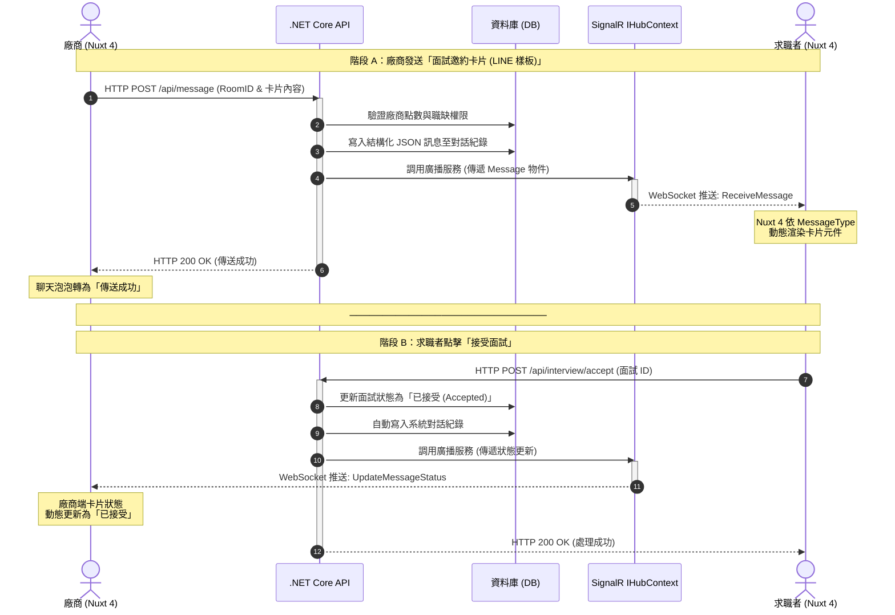

# 工程端提供之循序圖（原始版，前後端視角）

> 來源：使用者於對話中直接提供的 mermaid 原始碼，描述「面試邀約卡片」發送與回覆的前後端技術流程（Nuxt 4 + .NET Core API + SignalR）。
> 本 repo 已將此圖與 HackMD 三份文件（E.1／訊息樣式／跨系統流程）比對後，整合進 `notes/uS9-跨系統流程與後端邏輯.md` 的循序圖（依業務語意調整用詞、補充 API 呼叫細節）；本檔保留原始版本供技術對照追溯。

## 整合到業務流程圖時的修正（使用者於 2026-07-02 指出）

1. **需前置 SignalR 常駐連線段**：兩端前端進入頁面即與 SignalR 建立連線並保持（用於接收訊息），此圖未畫出，已在整合版補上「〇、建立即時連線」段。
2. **驗證／檢查需在寫入 DB 之前，失敗要擋住**：原圖「驗證廠商點數與職缺權限」雖列在寫入前，但「計算履歷瀏覽數」等雜項判斷在此圖未展開；整合版明確把所有前置檢查移到寫入信件主表之前，並加 `break` 區塊表示失敗時擋住、不寫入。
3. **寄信非即時**：原圖未描述寄信環節；跨系統流程稿曾寫「寄 E-mail 給求職者」暗示即時寄出，使用者澄清實際是「加入寄信排程」，處理很快但不會馬上寄出。
4. **回信依類別分流寄信排程**：求職者回覆若為「一般訊息」，需將通知加入廠商帳號（信件收件人）的「收信區間排程」（每帳號設定不同區間彙整寄出），而非直接寄送；其他類別（意願回覆等）走一般寄信排程。

整合後的完整版本見 `notes/uS9-跨系統流程與後端邏輯.md` 的「完整流程圖（循序圖）」章節。
