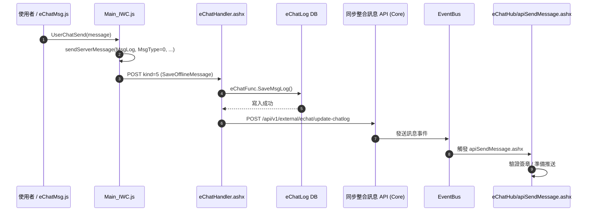
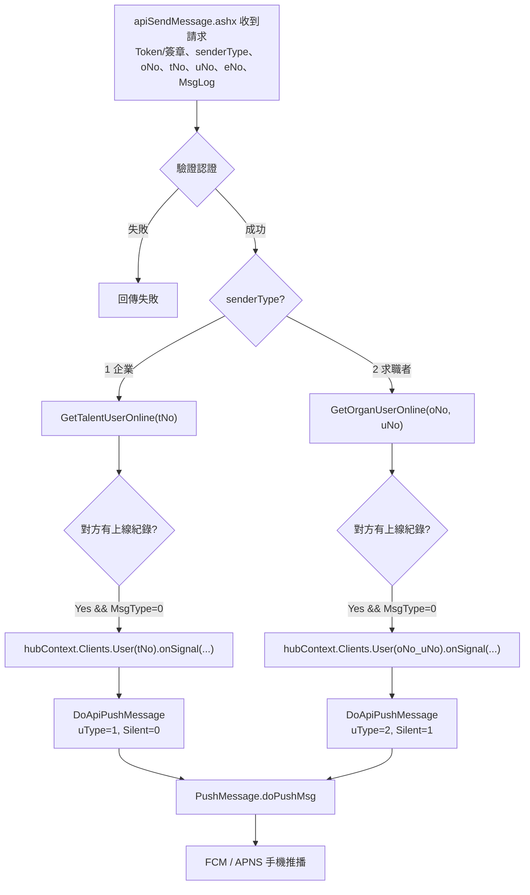
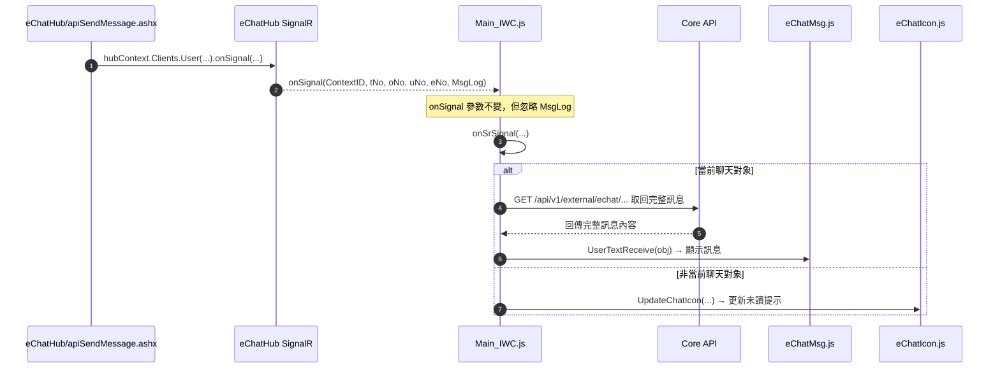

# 新版即時通 — 訊息送出與接收流程圖

> 來源：工程端提供的架構說明 PDF，描述即時通訊息從前端送出、寫入 DB、到即時推播對方的完整技術流程。
> 與 `notes/api/echat-update-chatlog.md`（`POST update-chatlog`）為同一支 API 在此架構中的呼叫點；本檔補足該 API 呼叫之後、EventBus 觸發即時推播的完整鏈路，是 `notes/uS9-跨系統流程與後端邏輯.md` 循序圖「即時推播」段落的技術依據。

## 架構重點（新版 vs 舊版）

- 前端 `Main_IWC.js` **不再直接送 `SendSignal` 給 `eChatHub`**。
- 訊息一律先由 `eChatHandler.ashx`（`kind=5`）存進 DB。
- DB 寫入成功後呼叫「**同步整合訊息 API**」（`POST /api/v1/external/echat/update-chatlog`，另一個 .NET Core 專案）。
- 同步整合訊息 API 透過 **EventBus** 觸發 `eChatHub/apiSendMessage.ashx`。
- 由 `apiSendMessage.ashx` **統一負責** SignalR 即時推送 ＋ FCM/APNS 手機推播。
- `onSignal` 參數與舊版 `SendSignal` **完全一致**，不因新版流程而改動（前端接收邏輯不需改）。

---

## 1. 訊息送出流程

### 送出端重點

- **唯一寫入點**：訊息由 `eChatFunc.SaveMsgLog()` 寫入 `[eChatLog]`，前端不再走 SignalR。
- **前端 `Main_IWC.js`**：`sendServerMessage` 只呼叫 `SaveOfflineMessage`，不再呼叫 `SendSignal`。
- **同步整合訊息 API**：`POST /api/v1/external/echat/update-chatlog`，由另一個 .NET Core 專案提供，接收 `SaveMsgLog` 完成後的呼叫，並負責把訊息事件推到 EventBus。
- **EventBus**：由另一個專案實作，訂閱端為 `apiSendMessage.ashx`。
- **順序保證**：先存 DB → 再發 EventBus → 再推送，即使推送失敗也能重試或補送。

---

## 2. apiSendMessage.ashx 內部流程

### 內部處理重點

- **認證方式**：目前為 Token 範例，之後會改為簽章認證。
- **不寫 DB**：`apiSendMessage.ashx` 不寫 `[eChatLog]`，訊息持久化已在前置 `SaveMsgLog` 完成。
- **即時推送**：透過 `GlobalHost.ConnectionManager.GetHubContext<eChatHub>()` 對線上接收端呼叫 `onSignal`。
- **`onSignal` 參數不變**：與 `SendSignal` 完全一致 — `(ContextID, tNo, oNo, uNo, eNo, MsgLog)`，前端不需改動接收邏輯。
- **手機推播**：由 `PushMessage.doPushMsg` 統一分派 FCM／APNS。

### senderType 分流（本 repo 對應求才/求職雙向）

| senderType | 發送方 | 查詢對方在線 | 推播對象 | `DoApiPushMessage` 參數 |
| :---: | --- | --- | --- | --- |
| 1 | 企業（求才廠商） | `GetTalentUserOnline(tNo)` | 求職者 | `uType=1, Silent=0` |
| 2 | 求職者 | `GetOrganUserOnline(oNo, uNo)` | 廠商該使用者 | `uType=2, Silent=1` |

> 僅當「對方有上線紀錄」**且** `MsgType=0` 時才呼叫 `onSignal` 做 SignalR 即時推送；`DoApiPushMessage`（手機推播）則不論在線與否都會呼叫。

---

## 3. 訊息接收流程

### 接收端重點

- **推送起點**：所有推送皆由 `apiSendMessage.ashx` 出發（不再由前端 `SendSignal`）。
- **`onSignal` 參數不變**：`onSignal(ContextID, tNo, oNo, uNo, eNo, MsgLog)` — 為配合舊版最小改動，Hub 傳遞參數維持原簽名不變。
- **忽略 `MsgLog`**：前端 `onSrSignal` 收到 `onSignal` 後**不使用**參數中的 `MsgLog`，僅視為「有新訊息」的通知信號。
- **打 API 取回訊息**：若為當前聊天對象，前端另外打 Core API 取回完整訊息內容後才顯示；此舉可確保顯示的訊息與 DB 一致，避免推送內容與存檔內容不同步。
- **非當前聊天對象**：只更新未讀提示，不打 API 取訊息。
- **`ContextID`**：接收端 `onSrSignal` 收到的 `ContextID` 為固定字串 `"apiSendMessage"`，可用來識別推送來源。

> ✅ **工程端討論確認**（2026/7/3，田圻勳／莊千慧／林彥宇／詹雁翔）：
> - 送出僅走 WebAPI（`eChatHandler.ashx kind=5`），前端**不做** SignalR invoke；SignalR 連線只用於「接收」信號。
> - `onSignal` 的 SignalR 訊號**只傳 KEY 值**（`ContextID`／`tNo`／`oNo`／`uNo`／`eNo`，不含訊息內容本身可用）。
> - 當前聊天對象打 API 取回的是**該對話「整包全部訊息」**（`get-detail` 整包回傳，含最新一則在內），**不是**只取單一新訊息 —— 對照現行求才系統既有行為（訊息收到後重撈全對話）沿用不變。
