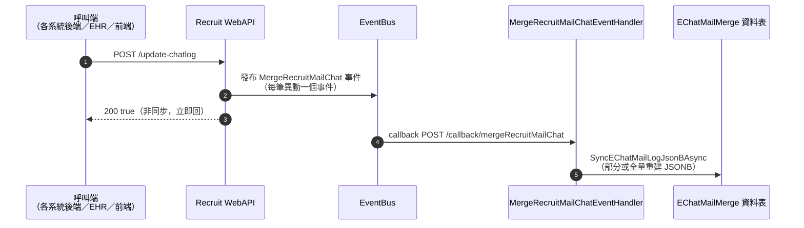

# 信件即時通整併-同步訊息狀態

UPDATE：2026/07/02

## 求才環境

1. 正式機：https://recruit.1111.com.tw/
2. STG測試機：https://recruit-stg.1111.com.tw/

## 取得API資料

### API 路徑

`/api/v1/external/echat/update-chatlog`

### HTTP method

POST

### HTTP Header

未登入：
- `X-CUSTOM-API-KEY`: (請先向求才端申請API金鑰)
- `Referer`：[網域(提交申請)]

### 如何呼叫

透過 HTTP GET 呼叫此 API。（原文如此，實際 method 為 POST，見上方）未登入狀態需於 Header 夾帶 `X-CUSTOM-API-KEY`、`Referer`；使用 API KEY (請先向求才申請API金鑰)。

範例（未登入呼叫）：

```
POST /api/v1/external/echat/update-chatlog
Header:
X-CUSTOM-API-KEY: xxxxxxxx
Referer : xxxxxxxx
```

### 備註

透過發送事件到 EventBus，由下游服務處理更新／合併記訊狀態的邏輯。`EChatLog` 或 `MailNoticeDetail` 有異動時打這支通知更新。

## Request 請求內容

### 後端預期 Body

```json
[
  {
    "organNo": 9565124,
    "AccountNo": "34611960",
    "employeesNo":132438815,
    "updateType": 0,
    "updateId": 0
  },
  {
    "organNo": 9565124,
    "AccountNo": "50973970",
    "employeesNo":132136854,
    "updateType": 0,
    "updateId": 0
  }
]
```

| 名稱 | 型態 | 欄位用意 | 說明 |
| --- | --- | --- | --- |
| organNo | int | 廠商編號 | |
| employeeNo | int | 職缺編號 | |
| AccountNo | string | 履歷編號 | |
| updateType | int | 異動類型 | 0:兩個表、1:Mail、2:EChatLog |
| updateId | int | 異動編號 | MailNoticeDetail.mailDetailNo 或 EChatLog.aNo；如需一次異動多筆則傳0 |

## Response 回傳訊息

### 後端預期 HTTP 200 Body

```
true
```

### API 欄位詳細描述

| 參數名稱 | 型別 | 說明 |
| --- | --- | --- |
| (回傳值本身) | boolean | 是否成功 |

HTTP Status Code 400、500系列，API 有特別處理才填寫

Status Code 400
```json
{
  "code": "InputError",
  "message": "OrganNo is required for simulated authentication on this path.",
  "errorUserNo": 0,
  "details": []
}
```

Status Code 401
```json
{
  "code": "VipUserNotFound",
  "message": "Invalid or missing API key.",
  "errorUserNo": 0,
  "details": []
}
```

> **前端備註（本 repo 分析）**：此 API 是「共同發送行為」與「共同回覆行為」中，緊接在「寫入信件主表」之後觸發的**整併同步**步驟，把即時通 `EChatLog` 與信件 `MailNoticeDetail` 兩個來源整併成 `get-detail` 的 `oJsonB`／`tJsonB` 合併視角（對應 `msgKind` 0即時通/1信件）。詳見 `notes/e1_seq_backend.md` 循序圖第四、五段。

## 內部機制（工程端提供，非同步整併）

呼叫端（各系統後端／EHR／前端皆可）打本 API 後，**立即回傳 `200 true`（非同步、不等待整併完成）**；實際的整併寫入是後續非同步流程：



> **呼叫端如何看到最新狀態**：本 API 是 fire-and-forget，回應的 `true` 只代表「事件已發布」，不代表整併已完成。呼叫端需**重新呼叫查詢 API**（`get-by-condition`／`get-detail`）才能看到整併後的最新狀態；聊天室情境則另由 `onSignal` 主動通知（見 `notes/uS9-跨系統流程與後端邏輯.md` 共同發送／回覆行為表 1.5／2.5 項）。
>
> ⚠️ 來源截圖中「開啟訊息中心」步驟仍顯示呼叫 `GET /get-echat-mail-logs` 取得列表——與該 API 已棄用、列表改用 `get-by-condition` 的既有記錄不一致，可能是示意圖沿用舊端點名稱繪製。列表載入請仍以 `get-by-condition` 為準（見 `notes/api/echat-get-echat-mail-logs.md` 棄用說明），此處保留原圖用詞供工程端核對。
