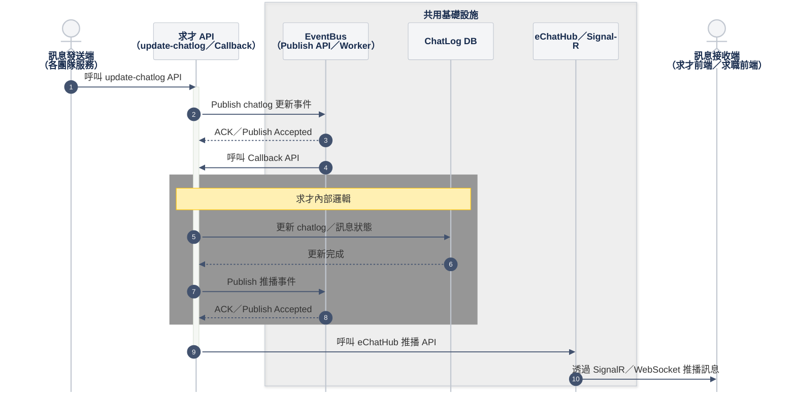
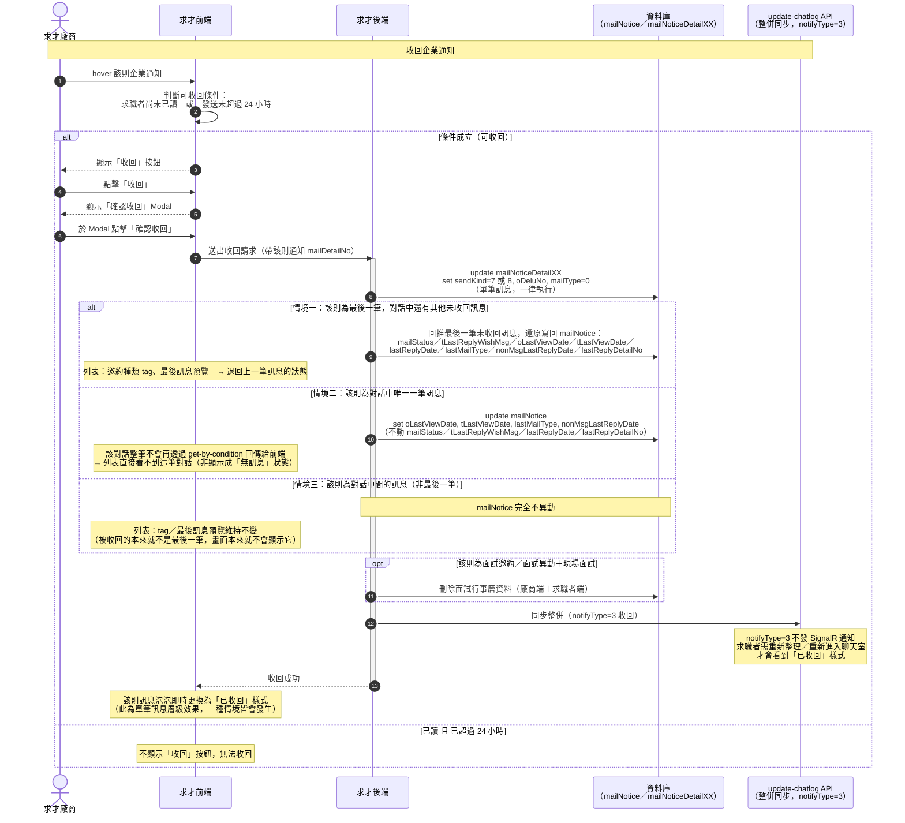

<!--markdownlint-disable MD033-->
<!--markdownlint-disable MD013-->

# [REF] 信件即時通整併－API 與代碼對照庫

> 本文為**查閱用對照表**（API 參數、回傳欄位、代碼枚舉、cursor 格式），不含產品行為說明。產品行為、畫面規格見 [E.1 聯絡人才](/cj-xlto2SdOtVskt3TkhdA)；訊息泡泡樣式見 [訊息樣式](/_8_6BHe5Qhu4VXJqaYRKOA)。
> 其他文件提到本文涵蓋的 API／代碼時，一律**連結至此**，不要複製表格（比照 [求才系統代碼表](/B1j3sN-bzx) 的用法）。各 API 完整回傳欄位定義的權威來源在 `notes/api/` 對應檔（本文只列查閱高頻的欄位與代碼）。
> 業務流程敘述、流程圖、循序圖收在 §8 附錄（預設收合），需要時展開。

## 版控紀錄

| 版本 | 日期 | 調整說明（異動區段 + 摘要） |
| :---: | :--- | :--- |
| v1.0 | 2026-08-07 | 全文重構並重啟版號：依 2026/08 最新 API 文件重整為「API 總覽 → 共同行為 → 流程圖 → SignalR 機制」四段式 |
| v2.0 | 2026-08-07 | **轉為純查閱對照庫**：拆分「查閱型」與「敘事型」內容——§1–§7 改為純表格（API／參數／cursor／回傳欄位／代碼／回覆對照／SignalR 動作），不寫解釋句；原共同發送/回覆行為、完整流程圖、循序圖、update-chatlog 內部架構全數搬進 §8 附錄（`:::spoiler` 收合，內容零損失）。新增 §5 代碼對照（`Type`／`SendKind`／`InterViewKind`／`ReplyWishMsg`／`DisplayType`）集中查閱 |
| v2.1 | 2026-08-18 | **收回機制調整**：依《信件即時通整併-收回機制》文件新增 §5.6 收回機制欄位（`mailNotice`／`mailNoticeDetailXX` 對話主表層級欄位：`oDeluNo`／`mailStatus`／`tLastReplyWishMsg`／`oLastViewDate`／`tLastViewDate`／`lastReplyDate`／`lastMailType`／`nonMsgLastReplyDate`）；新增 §8.7 收回機制三種情境（最後一筆有其他對話／唯一一筆／對話中間），各情境異動欄位範圍不同；來源圖片連結已過期無法擷取，三處皆標 🚧 待補圖 |
| v2.2 | 2026-08-18 | 補 §8.7 收回機制三種情境示意圖（狀況一／二／三，圖床 Cloudflare R2） |
| v2.3 | 2026-08-18 | [§8.7] 補回情境二確認結果（唯一一筆訊息被收回後，該對話不再透過 `get-by-condition` 回傳給前端，非顯示成空狀態——上一版覆蓋時漏掉）；補**面試行事曆連動刪除**已確認：被收回訊息若為面試邀約／面試異動＋現場面試，無論情境一二三皆額外刪除該筆面試行事曆資料（廠商＋求職者端）；新增完整收回流程循序圖 |

---

## 1 API 一覽

| # | 場景 | API | 關鍵參數 | 回傳 |
| :--: | :--- | :--- | :--- | :--- |
| 1 | 載入左側聊天列表 | `GET get-by-condition` | 不帶 keyword／篩選即為列表；`organNo`、`empNo`、`talentNo`、`cursor`、`limit` | 對話摘要**陣列** |
| 2 | 搜尋關鍵字／切換篩選 Tab | `GET get-by-condition`（同一支兼列表＋搜尋） | 加 `keyword` 與篩選條件（見 §2.1） | 同上 |
| 3 | 列表筆數／Tab badge | `GET get-by-condition-count` | `organNo`、`empNo`、`talentNo`（皆選填） | 9 項統計數字（見 §4.3） |
| 4 | 進聊天室載入對話明細 | `GET get-detail/{infoNo}` | `infoNo`（必）、`organNo`（必）、`cursor`、`limit`、`isFetchOldData` | 對話主體＋`oJsonB`／`tJsonB` 訊息明細 |
| 5 | 資料異動後同步整併 | `POST update-chatlog` | `organNo`、`accountNo`、`employeesNo`、`updateType`、`updateId`、`notifyType` | `true` |

**已棄用**：`get-echat-mail-logs`（列表載入改用 `get-by-condition`，見 `notes/api/echat-get-echat-mail-logs.md`）。

> 訊息明細**只能**從 `get-detail` 取得；`get-by-condition` 只回對話層級摘要，不含 `oJsonB`／`tJsonB`。各 API 完整回傳欄位見 `notes/api/` 對應檔：`echat-get-by-condition.md`／`echat-get-detail-infoNo.md`／`echat-update-chatlog.md`。

## 2 查詢／同步參數

### 2.1 `get-by-condition` Query

| 參數 | 說明 |
| :--- | :--- |
| `keyword` | 求才端搜求職編號、求職姓名、職編、職名（求職端搜廠編、廠名、職編、職名） |
| `readStatus` | 是否已讀：`0` 未讀／`1` 已讀 |
| `wishStatus` | 求職者意願回覆：`0` 未回覆／`1` 有意願／`2` 婉拒／`3` 更改時間 |
| `mailType` | 信件類別，見 §5.1 |
| `interviewKind` | 面試類別：`0` 不拘／`1` 實體／`2` 遠距（無用）／`3` 刪除 |
| `sendType` | **陌生訊息判斷依據**：`0` 求才發信／`1` 求職者先發信（＝陌生訊息）／`-1` 排除陌生訊息 |
| `MailCategory` | （求職端）過濾通知信分類：`0` 全部信件（含 null 未處理）／`1` 您可能感興趣的工作 |
| `IsStar` | 星號：`true` 有星號／`false` 無星號 |
| `mailStatus` | 回覆狀態：`true` 已回覆／`false` 未回覆 |
| `userNos` | 廠商使用者編號，可用 `,` 帶多筆 |
| `startDate`／`endDate` | 日期區間 |
| `organNo`／`empNo`／`talentNo`／`tName` | 廠商／職缺／求職者篩選 |
| `cursor`／`limit` | 分頁，見 §3 |
| `isGetSpecifiedCursor` | `true` 時指定顯示特定 cursor 的那一筆，預設 `false` |

### 2.2 `get-detail/{infoNo}` Query

| 參數 | 型別 | 必填 | 說明 |
| :--- | :--- | :--: | :--- |
| `infoNo` | int | 是 | 路徑參數；列表回傳的 `rNo` |
| `organNo` | int | 是 | 廠商編號 |
| `cursor` | string | 否 | 見 §3（🚧 格式待確認） |
| `limit` | int | 否 | 查詢 size |
| `isFetchOldData` | bool | 否 | 是否取舊資料，預設 `false`（取新） |

### 2.3 `get-by-condition-count` Query

| 參數 | 型別 | 必填 | 說明 |
| :--- | :--- | :--: | :--- |
| `organNo` | int | 否 | 廠商編號 |
| `empNo` | int | 否 | 職缺編號 |
| `talentNo` | int | 否 | 求職者編號 |

### 2.4 `update-chatlog` Body

Request 為**陣列**，每筆一個異動：

| 欄位 | 型別 | 說明 |
| :--- | :--- | :--- |
| `organNo` | int | 廠商編號 |
| `accountNo` | string | 履歷編號 |
| `employeesNo` | int | 職缺編號 |
| `updateType` | int | 異動類型：`0` 兩個表／`1` Mail／`2` EChatLog |
| `updateId` | int | 異動編號（`MailNoticeDetail.mailDetailNo` 或 `EChatLog.aNo`）；帶 `0` 視為完整同步 |
| `notifyType` | int | SignalR 通知型態，見下表 |

**`notifyType`**（決定要不要發 SignalR 通知、通知回傳什麼）：

| `notifyType` | 異動性質 | SignalR 通知行為 |
| :--: | :--- | :--- |
| `0` | 更新／新增 | 單筆通知，回傳 `infoNo`、`bNo` |
| `1` | 已讀 | `updateId=0` 時匯整成一筆通知，回傳 `infoNo` |
| `2` | 刪除 | 不做通知（`updateId` 帶 `0`，API 匯整一筆給 EventBus） |
| `3` | 收回 | 不做通知 |
| `4` | 星號 | 🚧 待確認 |

:::warning
🚧 **待確認：`notifyType=4`（星號）的通知行為**

API 文件列出 `4:星號` 的語意，但通知行為只寫到 `notifyType=3`，未載明 `4` 是否發通知、回傳什麼。

* 待確認：
  * [ ] `notifyType=4` 是否發 SignalR 通知？若發，回傳 `infoNo` 還是 `infoNo`＋`bNo`？
* 來源：`信件即時通整併-同步訊息狀態` API 文件 2026/08/05
:::

**同步涵蓋的資料表**：`EChatLog`、`MailNotice`、`MailNoticeDetailxx`、`mailCalendar.infoNo`、`mailAttachFiles.infoNo`、`mailStarMark.infoNo`、`oCalendar.infoNo`。

## 3 cursor 對照

| 用途 | API | 格式 | 指向 |
| :--- | :--- | :--- | :--- |
| 列表／搜尋翻頁 | `get-by-condition` | `{organNo}_{RNo}` | **對話**層級（`RNo`＝該筆對話編號） |
| 聊天室取訊息 | `get-detail/{infoNo}` | `{organNo}_{bNo}` | **訊息明細**層級（`bNo`＝訊息流水號） |

:::warning
🚧 **待確認：`get-detail` 的 cursor 格式表述不一致**

API 文件（2026/08/06）內三處寫法不同：標題寫 `cursor={organNo}_{bNo}`、Query 參數表寫「指標 infoNo.bNo」、Body 範例寫 `cursor=1`。

* 現況：本文依**標題**的 `{organNo}_{bNo}` 撰寫（與 `get-by-condition` 的 `{organNo}_` 前綴一致）
* 待確認：
  * [ ] 正確格式為 `{organNo}_{bNo}`？分隔符號是 `_` 還是 `.`？
* 來源：`信件即時通整併-取得指定記訊明細` API 文件 2026/08/06
:::

## 4 回傳資料速覽

### 4.1 對話摘要／對話主體

完整欄位定義見 `notes/api/echat-get-by-condition.md`（列表／搜尋回傳的對話摘要陣列）與 `notes/api/echat-get-detail-infoNo.md`（`get-detail` 回傳的對話主體，不含訊息明細）。

### 4.2 訊息明細巢狀物件（`oJsonB`／`tJsonB` 內）

| 物件 | 用途 | 主要欄位 |
| :--- | :--- | :--- |
| `AttachFiles` | 附件 | `mailFileNo`、`mailDetailNo`、`addKind`（`0` 廠商／`1` 求職者建立）、`showFileName`（顯示檔名）、`fileName`（實際檔名）、`fileExt`（見 §5.5）、`dateIn`、`infoNo` |
| `Calendar` | 面試行事曆 | `sNo`、`mailDetailNo`、`calendarNo`、`addKind`、`mailType`、`setDate`（邀約時間）、`zoomScheduleNo`、`isConfirm`（`1` 選取／`0` 未選取）、`confirmMailDetailNo`、`infoNo` |
| `E2Calendar` | 舊行事曆 | `sNo`、`organNo`、`userNo`、`resumeNo`、`kind`、`title`、`memo`、`dates`、`meetUser`（面試官）、`infoNo` |

面試邀約卡片補充欄位：`contactPerson`（聯絡人）、`interViewPhone`（聯絡電話）、`interViewAddress`（面試地址）、`wishReplyDay`（希望回覆天數）、`wishReplyDate`（希望回覆日期）、`lastReplyDetailNo`（需回覆意願的 `mailDetailNo`，`mailType` 為 `1`／`6`／`8` 時有值）。

> `FileName`／`FilePath` 兩個舊欄位仍列在 JsonB 欄位表中但實際回傳為 `null`，附件一律改讀 `AttachFiles`。

### 4.3 `get-by-condition-count` 回傳欄位

| 欄位 | 說明 |
| :--- | :--- |
| `totalCount` | 當前條件下的總筆數 |
| `byRecruitCount` | 求才發信筆數（`SendType <= 0`） |
| `byMemberCenterCount` | **陌生訊息**筆數（`SendType == 1`） |
| `recommendedCount` | 一般／非感興趣信件筆數（`MailCategory != 1` 或 null） |
| `filteredCount` | 感興趣工作信件筆數（`MailCategory == 1`） |
| `unreadCount` | 未讀筆數 |
| `readCount` | 已讀筆數 |
| `starCount` | 星號註記筆數 |
| `wishedCount` | 求職者意願回覆筆數 |

## 5 代碼對照

### 5.1 `Type` / `mailType`（信件類別）

| 代碼 | 意義 |
| :--: | :--- |
| `0` | 其他／一般訊息 |
| `1` | 面試邀約 |
| `2`／`3`／`4`／`7` | 詢問意願／邀請加入／審核階段／面試確認（**目前無使用**） |
| `5` | 遺珠函／感謝函 |
| `6` | 到職確認 |
| `8` | 面試異動 |
| `9` | 即時通訊 |

### 5.2 `SendKind`（寄件者）

| 代碼 | 意義 |
| :--: | :--- |
| `0` | 廠商 |
| `1` | 求職者 |
| `3` | 廠商系統訊息（廠商動作產生） |
| `4` | 求職者系統訊息（求職動作產生） |
| `5` | 求才發給求職系統信（`3` 動作產生） |
| `6` | 求職給求才系統信（`4` 動作產生） |
| `7` | 求才回收訊息 |
| `8` | 求職者回收訊息 |
| `9` | 即時通廠商轉入（視為 `0`） |
| `10` | 即時通求職者轉入（視為 `1`） |

| 情境 | 對應 `SendKind` |
| :--- | :--- |
| 廠商端顯示 | `0,1,3,6,9,10` |
| 求職端顯示 | `0,1,4,5,9,10` |
| 廠商寄出信件 | `0,5` |
| 求職者寄出信件 | `1,6` |

### 5.3 `InterViewKind`（面試類別，訊息明細內）

> 與 §2.1 篩選參數 `interviewKind` **代碼不同**，勿混用：

| 代碼 | `InterViewKind`（訊息明細） | `interviewKind`（篩選參數） |
| :--: | :--- | :--- |
| `0` | 詢問意願 | 不拘 |
| `1` | 現場面試 | 實體 |
| `2` | 遠距 | 遠距（無用） |
| `3` | 刪除 | 刪除 |

### 5.4 `ReplyWishMsg`（求職者意願回覆）

| 代碼 | 意義 |
| :--: | :--- |
| `0` | 未回覆 |
| `1` | 有意願 |
| `2` | 婉拒 |
| `3` | 更改時間 |

### 5.5 其他代碼

| 欄位 | 代碼對照 |
| :--- | :--- |
| `DisplayType` | `0` 一般字串／`1` JSON 格式字串／`2` 語音 JSON（`msgType:6`） |
| `AttachFiles.fileExt` | `1` doc／`2` pdf／`3` ppt／`4` docx／`5` pptx／`6` xls／`7` xlsx |
| `updateType`（`update-chatlog`） | `0` 兩個表／`1` Mail／`2` EChatLog |

### 5.6 收回機制欄位（`mailNotice`／`mailNoticeDetailXX`）

`mailNoticeDetailXX` 為單筆訊息明細表；`mailNotice` 為該筆對話的主表（存最新狀態的分母，供列表快速讀取）。收回訊息時，`mailNoticeDetailXX` 一律異動，`mailNotice` 是否異動、異動哪些欄位則依三種情境而定（見 §8.7）。

| 資料表 | 欄位 | 說明 |
| :--- | :--- | :--- |
| `mailNoticeDetailXX` | `oDeluNo` | 廠商刪除／收回者編號 |
| `mailNotice` | `mailStatus` | 信件狀態：`1` 廠商寄出／`0` 求職者回覆 |
| `mailNotice` | `tLastReplyWishMsg` | 求職者最後意願回覆（代碼同 §5.4 `ReplyWishMsg`）；廠商信件狀態為 `mailType:1`（面試邀約）／`8`（面試異動）／`6`（到職確認）時，收回後清空為 `0` |
| `mailNotice` | `oLastViewDate` | 廠商最後已讀日期（未讀＝`1911/1/1`） |
| `mailNotice` | `tLastViewDate` | 求職者最後已讀日期（未讀＝`1911/1/1`） |
| `mailNotice` | `lastReplyDate` | 求職者／廠商最後信件回覆日期 |
| `mailNotice` | `lastMailType` | 最後一筆信件類別（求職端用；僅更新 `mailType:1／5／6／8`） |
| `mailNotice` | `nonMsgLastReplyDate` | 求職者／廠商非一般訊息（`mailType:1／5／6／8`）的最後回覆日期（求職端用，判斷 90 天過期） |
| `mailNotice` | `lastReplyDetailNo` | 需回覆意願的 `mailDetailNo`（`mailType:1／6／8` 時有值；即 §4.2 面試邀約卡片補充欄位） |

> 收回後 `mailNoticeDetailXX.sendKind` 改為 `7`（求才回收）或 `8`（求職者回收，代碼見 §5.2）、`mailType` 清空為 `0`。

## 6 類型 → 回覆方式對照

| 發送的邀約類型 | 求職者回覆方式 | 回覆後特殊處理 |
| :--- | :--- | :--- |
| 詢問意願 | 回覆有無意願（有意願 / 婉拒） | — |
| 面試邀約 | 回覆有無意願（接受指定時段 / 婉拒面試 / 更改時間） | 接受 → 寫入面試行事曆；更改時間 → 求職者要求其他時段（後續流程 `待補`） |
| 錄取通知 | 回覆有無意願（同意報到 / 婉拒） | — |
| 一般訊息 | 自由文字回覆 | — |
| 感謝函 | 不可回覆，對話結束 | — |

## 7 常用動作（Action）對照表

| 方向 | 動作名稱 | 端 | 新版狀態 | 說明 |
| :--- | :--- | :--- | :--- | :--- |
| 前端發送 | `setoUser` | 求才 | ✅ **保留**（新版仍使用） | 上線報到；觸發時機＝`signalR.on` 註冊後馬上觸發；不需帶額外參數 |
| 前端發送 | `settUser` | 求職 | ✅ **保留**（新版仍使用） | 求職端上線報到；觸發時機＝`signalR.on` 註冊後馬上觸發；不需帶額外參數 |
| 前端發送 | `setRoomInfo` | 求職 | ❌ **廢止**（未列入保留清單，不再需要） | 舊版設定聊天室資訊 |
| 前端發送 | `getUserStatus` | 求職 | ❌ **廢止**（未列入保留清單，不再需要） | 舊版查詢對方線上狀態；新版線上狀態由後端於推播前查（`GetTalentUserOnline`／`GetOrganUserOnline`） |
| 前端發送 | `sendMsgPush` | 求才／求職 | ❌ **廢止** | 舊版送出文字訊息的 SignalR invoke；新版送出改走 WebAPI（求才 `eChatHandler.ashx kind=5`／求職自有送出 API），前端不再 invoke |
| 前端發送 | `updateMsgReaded` | 求才 | ❌ **廢止（改走 WebAPI）** | 舊版由前端 invoke 標記已讀；新版**前端不再 invoke**——已讀改打 WebAPI 寫進 DB 並以 `notifyType=1` 同步，前端只需處理接收事件 `onUpdateReaded` |
| 後端推播 | `onTextMessage` | 求才／求職 | ❌ **廢止（由 `onSignal` 取代）** | 舊版接收文字訊息事件（`signalr?.on('onTextMessage', handleReceive)`） |
| 後端推播 | `onSignal` | 求才／求職 | ✅ **新版接收事件** | 參數 `(ContextID, tNo, oNo, uNo, eNo, MsgLog, infoNo, bNo)`，`ContextID` 固定 `"apiSendMessage"` 供識別推送來源；`infoNo`＝該次異動對話的 `rNo`（可直接打 `get-detail/{infoNo}`）；`bNo`＝該次異動的訊息明細流水號；**原有參數都保留、只增不改，之後若擴充一律附加在後面**。前端忽略 `MsgLog`，其餘 KEY 參數即後續打「取對話 API」的參數 |
| 後端推播 | `onUpdateReaded` | 求才／求職 | ✅ **新版接收事件** | 對方讀取後、已讀寫入 DB 由後端（`notifyType=1`）觸發 SignalR 推播；前端接收此事件後更新雙方的已讀狀態 |

---

## 8 附錄（業務流程敘述＋流程圖，展開閱讀）

> 以下內容為業務流程的敘事說明與視覺化，非查閱用表格。日常查參數／欄位／代碼請用 §1–§7；只有需要理解「整體怎麼運作」時才展開本節。

:::spoiler 8.1 共同發送行為（求才系統）

廠商送出任一類型（詢問意願／面試邀約／錄取通知／一般訊息／感謝函）後觸發：

| # | 動作 | 端 |
| :--: | :--- | :--- |
| 0 | 驗證廠商點數與職缺權限、計算並檢查履歷瀏覽數 —— **失敗則擋住，不寫入資料庫** | 求才後端 |
| 1 | 寫入信件主表（更新 DB） | 求才後端 |
| 1.5 | **呼叫 `update-chatlog` API**（同步呼叫，帶 `notifyType`）→ 該 API 內部 Publish 事件到 EventBus、等非同步 Callback 回呼後才實際整併寫入 ChatLog DB → 再 Publish 推播事件 → 呼叫 SignalR（`onSignal`）通知求職主網、統一分派推播給求職 App（內部架構見 8.5） | 求才後端 → update API → EventBus → DB → SignalR |
| 2 | 將「給求職者的通知信」**加入寄信排程**（不即時寄出，處理很快但非馬上送出） | 求才後端 |
| 3 | 將「給廠商副本收件人的信」加入寄信排程 | 求才後端 |
| 4 | 計算履歷瀏覽數（與其他雜項判斷） | 求才後端 |
| 5 | 廠商畫面即時更新 | 求才前端 |

> 第 1.5 項為求職者收到通知、回到求職主網的觸發來源；連線機制見 8.3。
>
> **第 4 項「計算履歷瀏覽數」細節**（舊版 [4.1 §5.2](/r1ghrPxP-x)）：寄出時寫入發信排程，執行排程時即時檢查廠商當日履歷瀏覽數是否足夠 —— 不足則不執行發信排程；足夠且成功寄出後扣除履歷瀏覽數。
>
> **寄出前檢查**（舊版 [4.1 §2.4／v1.0.4](/r1ghrPxP-x)，既有後端規則，新版沿用待確認）：
> 1. 含指定關鍵字 `留下LINE`（不分大小寫全半形）／`留下賴`：訊息仍寫入資料庫並標 `DELFLAG`、**不寄送 Email**，前台依求職規則顯示或隱藏。
> 2. 含違規字眼（如 `104`）：點「寄出」時不顯示 loading，直接 alert 阻擋送出（`內容含有違規字詞，請調整後再送出。`）。

:::

:::spoiler 8.2 共同回覆行為（求職系統）

求職者於求職主網回覆後，鏡像對應「共同發送行為」，執行端改為求職系統：

| # | 動作 | 端 |
| :--: | :--- | :--- |
| 1 | 更新回覆／面試狀態（如「已接受」、`ReplyWishMsg`） | 求職後端 |
| 2 | 寫入信件主表＝自動寫入系統對話紀錄（系統訊息 與 一般訊息） | 求職後端 |
| 2.5 | **呼叫 `update-chatlog` API**（同步呼叫，帶 `notifyType`）→ 內部流程同 8.1 第 1.5 項 → 呼叫 SignalR 通知求才系統、發送推播給求才 App | 求職後端 → update API → EventBus → DB → SignalR |
| 3 | 判斷回信類別：**一般訊息**→加入廠商帳號（信件收件人）的「**收信區間排程**」（每帳號設定的收信區間不同，依區間彙整寄出）；**其他類別**（意願回覆等）→加入一般寄信排程 | 求職後端 |
| 4 | 將「給廠商副本收件人的信」加入寄信排程 | 求職後端 |
| 5 | 計算回覆狀態（與其他雜項判斷） | 求職後端 |
| 6 | 求職者畫面即時更新 | 求職前端 |

> 回覆完成後另判斷：若回覆為同意面試，求職後端額外寫入面試行事曆（求才與求職雙方）。
> 「回覆有無意願」分支由求職前端帶入系統預設文字（如「我有意願」）寫入一般訊息；自由文字回覆則由求職者自行輸入。

:::

:::spoiler 8.3 SignalR / WebSocket 即時通連線機制

聊天室的即時訊息採 **SignalR**（底層走 WebSocket）推播：本次改版後 SignalR 連線**只負責「接收」信號**，訊息送出與已讀寫入一律走 WebAPI。

**連線時機與帶的資訊**

- **連線時機**：進入「聯絡人才」（求才）／「聯絡公司」（求職）頁後，**選定／指定特定聊天室當下**才建立連線（非進系統即連線）。
- 建立連線時帶上以下資訊辨識身分與頻道：

| 名稱 | 意義 |
| :--- | :--- |
| `Token` | 登入憑證（確認已登入） |
| `oNo` | 公司編號 |
| `uNo` | 使用者編號 |
| `echathub` | 聊天頻道名稱（全系統統一用這個） |

> 為避免閒置斷線，系統會固定間隔自動偵測連線是否存活（心跳），斷線自動重連。

**新版業務流程（送出走 WebAPI、SignalR 只收信號）**

1. **送出**：前端**不做 SignalR invoke**，改打 WebAPI 存進 DB。
   - **求才端**：打 `eChatHandler.ashx`（`kind=5`）WebAPI（`eChatFunc.SaveMsgLog()`＝唯一寫入點）。
   - **求職端**：打**求職自己提供的送出 API**（**非** `eChatHandler.ashx`）；登入認證用求職端各自的 cookie，API 名稱與參數與求才端**不同、不共用**。
2. **DB 寫入成功後，各單位（求才／求職後端）同步呼叫 `update-chatlog` API**，並依異動性質帶入對應的 `notifyType`（見 §2.4）。
3. `update-chatlog` API 內部先 **Publish 一筆「chatlog 更新事件」到 EventBus**、取得 `ACK / Publish Accepted` 立即回應（此時尚未真正整併資料）；EventBus 之後**非同步呼叫回 `update-chatlog` API 的 Callback 端點**，才在這個 Callback 裡實際把 chatlog／訊息狀態整併寫入 ChatLog DB。
4. DB 更新完成後，`update-chatlog`／`Callback` **再 Publish 一筆「推播事件」到 EventBus**（同樣先拿 `ACK` 再非同步處理），內部驗證簽章、查對方線上狀態後，直接呼叫 `eChatHub` 推播 API，對在線接收端呼叫 `onSignal` 做 SignalR 即時推送，並統一分派 FCM／APNS 手機推播。
5. **接收**：前端 `onSignal` 收到的只是「有新訊息」的**通知信號**；`MsgLog` 直接忽略，但**其餘 KEY 參數（`tNo`／`oNo`／`uNo`／`eNo`／`infoNo`／`bNo`）即後續打「取對話 API」所需的參數**——`infoNo`＝該次異動對話的 `rNo`，可直接打 `get-detail/{infoNo}`（求才／求職共用同一支）取得該對話訊息；前端帶上本地已存最大 `bNo` 組成 `cursor={organNo}_{bNo}`，讓後端只回傳該 `bNo` 之後的新資料，**不必每次都整室重新渲染全部**；非當前聊天室僅更新未讀提示。
6. **已讀回報**：**廠商進入特定聊天室時，將該聊天室內來自求職者的全部未讀訊息一次性標記為已讀**（不判斷是否捲動到特定訊息位置；求職端讀取廠商訊息的觸發規則待補）。標記已讀時前端**不做 SignalR invoke**，改打 WebAPI 把已讀紀錄寫進 DB，並以 `notifyType=1` 呼叫 `update-chatlog`；對方前端以 `onUpdateReaded` 事件接收後更新雙方的已讀狀態。

**收回訊息與即時性**：收回走 `notifyType=3`，後端**不發即時通知**，對方需重新取對話才會看到收回後的樣式。

:::

:::spoiler 8.4 完整流程圖

:::

:::spoiler 8.5 完整流程圖（循序圖 Sequence Diagram）

與 8.4 同一套邏輯改以循序圖呈現，並整合前後端技術流程與各 API 的實際呼叫位置。

```mermaid
---
config:
  theme: base
  rightAngles: true
  themeVariables:
    fontFamily: "Inter, Helvetica, Arial, sans-serif"
    primaryColor: "#F4F5F7"
    primaryBorderColor: "#C1C7D0"
    primaryTextColor: "#172B4D"
    signalColor: "#42526E"
    signalTextColor: "#333333"
    noteBkgColor: "#FFF0B3"
    noteBorderColor: "#FFC400"
  sequence:
    actorFontSize: 17
    actorFontWeight: bold
    messageFontSize: 16
    noteFontSize: 15
    wrap: true
    wrapPadding: 12
    actorMargin: 70
    boxMargin: 12
    boxTextMargin: 8
    messageMargin: 42
    mirrorActors: false
---
sequenceDiagram
    autonumber

    box rgba(100,150,200,0.1) 求才系統
        actor Emp as 求才廠商
        participant RF as 求才前端
        participant RB as 求才後端
    end

    box rgba(200,200,200,0.1) 共用基礎設施
        participant DB as 資料庫
        participant Bus as 事件匯流排<br>（EventBus）
        participant Push as update-chatlog API<br>（整併記訊＋SignalR 推播）
        participant Hub as 即時推播<br>（eChatHub SignalR／FCM／APNS）
    end

    box rgba(180,160,200,0.1) 求職系統
        participant SB as 求職後端
        participant SF as 求職前端<br>（求職主網／App）
        actor Seeker as 求職者
    end

    %% ===== 一、進入聯絡人才頁（整併原一＋三：載入列表＋指定聊天室明細＋SignalR） =====
    rect rgb(227, 242, 253)
    Note over Emp,DB: 一、進入「聯絡人才」頁（載入左側列表；正常情況已指定聊天室 → 一併載入該室明細並建立 SignalR）
    Emp->>RF: 進入「聯絡人才」頁
    RF->>RB: GET get-by-condition（列表載入，get-echat-mail-logs 已棄用）<br>（廠商編號／職缺編號，limit＋cursor={organNo}_{RNo} 分頁）
    RB->>DB: 查詢整併後的記訊列表
    DB-->>RB: 每筆對話摘要
    RB-->>RF: 回傳列表（最後一則訊息、最後訊息類型、<br>雙方最後查看時間、意願回覆狀態、釘選）
    RF->>RB: GET get-by-condition-count<br>（廠商編號／職缺編號／求職者編號）
    RB-->>RF: 回傳筆數統計（總數、求才發信、陌生訊息、<br>一般、感興趣、未讀、已讀、星號、意願回覆）
    Note over RF: 渲染左側聊天列表：<br>信件類型標籤＝最後訊息類型<br>未讀判斷＝比對「公司最後查看時間」與「最後更新時間」<br>Tab 筆數／badge＝count API 回傳的統計值
    alt 已指定聊天室（正常情況：由通知／URL 帶入 rNo）
        RF->>RB: GET get-detail/{infoNo}<br>（infoNo＝該筆 rNo，organNo 必帶；<br>cursor={organNo}_{bNo}＋limit；<br>isFetchOldData 控制取新／取舊）
        RB->>DB: 取得該筆對話完整內容
        DB-->>RB: 對話資料＋廠商視角／求職者視角訊息明細
        RB-->>RF: 回傳廠商視角訊息明細
        Note over RF: 依明細渲染右側聊天室：<br>寄件者代碼→泡泡左右與收回樣式<br>信件類別＋面試類別→一般訊息／邀約卡片<br>已讀未讀＝訊息已讀旗標＋雙方已讀日期
        RF->>RB: 已讀標記 WebAPI（名稱待補）<br>將該聊天室內來自求職者的全部未讀訊息一次標記已讀<br>（不判斷是否捲動到特定訊息，整室未讀全部寫入；非 SignalR invoke）
        RB->>DB: 寫入已讀狀態（Readflag／OViewDate）
        RB-->>RF: 完成
        Note over RB,Hub: 該 API 呼叫 SignalR 通知求職前端 onUpdateReaded<br>（與「送出走 WebAPI、SignalR 只收信號」同一套模式）
        RF->>Hub: 建立 SignalR 連線並加入該聊天室頻道<br>（登入憑證、公司編號、使用者編號，頻道 echathub）
        Note over Hub: 進入指定聊天室即連線；固定間隔心跳偵測、斷線自動重連
    else 未指定聊天室（僅載入列表，待點選）
        Emp->>RF: 點選左側某筆對話（選擇聊天室）
        Note over RF,Hub: 走上方相同流程：GET get-detail 載入該室明細 → 已讀標記 WebAPI → 建立 SignalR 連線並加入頻道
    end
    end

    %% ===== 二、搜尋與篩選 =====
    rect rgb(255, 249, 230)
    opt 二、搜尋關鍵字 或 切換篩選 Tab（一般／陌生訊息）
        Emp->>RF: 輸入關鍵字／切換 Tab
        RF->>RB: GET get-by-condition<br>（keyword、已讀未讀、意願回覆、信件類別、面試類別、<br>發送類型、星號、通知信分類、回覆狀態、日期區間、<br>cursor={organNo}_{RNo}＋limit 分頁…）
        Note over RB: 發送類型判斷陌生訊息：<br>0＝求才發信／1＝求職者先發信（陌生訊息）<br>／-1＝排除陌生訊息
        RB->>DB: 依條件搜尋歷史記訊
        DB-->>RB: 符合條件的對話
        RB-->>RF: 回傳搜尋結果（對話摘要陣列；<br>訊息明細仍需個別打 get-detail/{infoNo}）
    end
    end

    %% ===== 三、廠商發送訊息／邀約 ＋ 共同發送行為 =====
    alt 無對話紀錄
        Emp->>RF: 於人才名單／履歷畫面發起新對話<br>（帶職缺等必要欄位）
    else 已有對話紀錄
        Emp->>RF: 於聊天室畫面延續現有對話
    end

    Note over Emp,RF: 選擇邀約類型並設定內容：<br>詢問意願／面試邀約／錄取通知<br>／一般訊息／感謝函
    Emp->>RF: 送出（帶入該類型內容）
    RF->>RB: 提交發送請求（對話編號＋卡片內容）<br>※求才端送出走 eChatHandler.ashx（kind=5）WebAPI，前端不做 SignalR invoke；<br>SignalR 連線只用於「接收」信號
    activate RB

    rect rgb(232, 245, 233)
    Note over RB,DB: 三、共同發送行為（求才系統）

    %% ----- 寫入前檢查：前後端溝通，失敗即擋住、不觸碰資料庫 -----
    RB->>RB: 驗證廠商點數與職缺權限<br>（前後端溝通，尚未觸碰資料庫）
    RB->>RB: 計算並檢查履歷瀏覽數<br>（與其他雜項判斷）
    break 驗證或檢查未通過
        RB-->>RF: 回傳錯誤，擋住送出<br>（此請求根本不會送到資料庫）
    end

    RB->>DB: 寫入信件主表<br>（eChatFunc.SaveMsgLog()，結構化訊息寫入對話紀錄，<br>驗證通過後第一次寫入資料庫；唯一寫入點）

    opt 發送類別為面試邀約
        RB->>DB: 額外寫入一筆面試資料至面試行事曆資料表<br>（求才端；面試欄位隨發送請求帶入）
    end

    %% ----- 信件即時通整併：各單位自更新 DB 後自打 EventBus → EventBus 呼叫 update-chatlog API → 該 API 呼叫 SignalR -----
    Note over RB,Bus: DB 更新後 → 求才後端自行發事件到 EventBus
    RB->>Bus: 發送異動事件到 EventBus<br>（廠商編號、履歷編號、職缺編號、<br>異動類型 0兩表／1信件／2即時通、異動編號）
    activate Bus
    Bus->>Push: 呼叫 update-chatlog API<br>（整併記訊狀態，並由此 API 收斂 SignalR 推送）
    deactivate Bus

    activate Push
    Push->>DB: 合併／更新記訊狀態<br>（即時通＋信件整併為單一對話紀錄）
    Push->>Push: 驗證簽章／Token；senderType=1（企業）<br>→ 查詢求職者是否在線 GetTalentUserOnline(tNo)
    alt 求職者在線 且 MsgType=0
        Push->>Hub: hubContext.Clients.User(tNo).onSignal<br>(ContextID="apiSendMessage", tNo, oNo, uNo, eNo, MsgLog, infoNo, bNo)
        Hub-->>SF: 即時推送 onSignal（接收事件名，取代舊版 onTextMessage）<br>（前端忽略 MsgLog；其餘 KEY 參數含 infoNo／bNo 即後續打「取對話 API」的參數<br>──infoNo＝該次異動對話的 rNo，可直接打 get-detail/{infoNo}；bNo＝該次異動的訊息明細流水號；<br>參數原有的都保留、只增不改，新增參數一律附加在後面）
    end
    Push->>Hub: DoApiPushMessage（uType=1, Silent=0）
    deactivate Push
    Hub-->>SF: FCM／APNS 手機推播（求職 App）

    Note over SF: 求職前端收到 onSignal 後（SignalR 只傳 KEY 值，含 infoNo／bNo）：<br>若為目前開啟中的聊天室 → 用 onSignal 帶的 infoNo 打 get-detail/{infoNo}（求才／求職共用同一支取對話 API）<br>前端帶上本地已存最大 bNo 組成 cursor={organNo}_{bNo}，讓後端只回傳該 bNo 之後的新資料，不必每次都整室重新渲染<br>若非目前開啟的聊天室 → 僅更新未讀提示圖示，不打 API

    %% ----- 寄信排程：兩封信最終各自寄到求職者 / 廠商副本收件人 -----
    RB-->>Seeker: 通知信加入寄信排程 → 寄至求職者 email<br>（非即時，由排程送出，處理時間很短）
    RB-->>Emp: 副本通知信加入寄信排程 → 寄至廠商副本收件人 email<br>（可視為求才廠商）
    RB-->>RF: 傳送成功
    deactivate RB
    Note over RF: 聊天泡泡轉為「傳送成功」<br>（廠商畫面即時更新）
    end

    %% ===== 四、求職者收到通知 → 進入「聯絡公司」頁 =====
    SF->>Seeker: 顯示新訊息通知
    Seeker->>SF: 進入「聯絡公司」頁

    rect rgb(232, 234, 246)
    Note over Seeker,Hub: 四、求職者進入「聯絡公司」頁（分辨是否已指定聊天室；有指定則立即建立 SignalR 連線）
    alt 已指定聊天室（如由通知／信件點入該對話）
        SF->>SB: 載入該對話明細（走列表／明細 API，固定帶求職者編號；<br>搜尋僅查最後一筆訊息）
        SB-->>SF: 回傳求職者視角訊息明細
        SF->>Hub: 立即建立 SignalR 連線並加入該聊天室頻道<br>（求職端身分，頻道 echathub）
    else 未指定聊天室（僅載入列表，待點選）
        Seeker->>SF: 點選某筆對話（選擇聊天室）
        SF->>SB: 載入該對話明細
        SB-->>SF: 回傳求職者視角訊息明細
        SF->>Hub: 建立 SignalR 連線並加入該聊天室頻道
    end
    end

    Note over SF,SB: 求職端送出走「求職自己提供的 API」（非 eChatHandler.ashx）；<br>認證用求職端各自的 cookie、參數與求才端不同
    alt 感謝函
        Note over SF,Seeker: 不可回覆，對話結束
    else 詢問意願／面試邀約／錄取通知
        Seeker->>SF: 點擊卡片按鈕回覆有無意願<br>（同意／婉拒，前端帶入系統預設文字）
        SF->>SB: 提交回覆（求職自有送出 API）
    else 一般訊息
        Seeker->>SF: 自由文字回覆
        SF->>SB: 提交回覆（求職自有送出 API）
    end

    rect rgb(243, 229, 245)
    opt 有回覆（非感謝函）
        activate SB
        Note over SB,DB: 五、共同回覆行為（求職系統）
        SB->>DB: 更新回覆／面試狀態<br>（面試狀態「已接受」、意願回覆代碼）
        SB->>DB: 寫入信件主表＝自動寫入系統對話紀錄<br>（系統訊息 與 一般訊息；唯一寫入點）

        %% ----- 信件即時通整併：各單位自更新 DB 後自打 EventBus → EventBus 呼叫 update-chatlog API → 該 API 呼叫 SignalR -----
        Note over SB,Bus: DB 更新後 → 求職後端自行發事件到 EventBus
        SB->>Bus: 發送異動事件到 EventBus<br>（廠商編號、履歷編號、職缺編號、<br>異動類型、異動編號）
        activate Bus
        Bus->>Push: 呼叫 update-chatlog API<br>（整併記訊狀態，並由此 API 收斂 SignalR 推送）
        deactivate Bus

        activate Push
        Push->>DB: 合併／更新記訊狀態<br>（即時通＋信件整併）
        Push->>Push: 驗證簽章／Token；senderType=2（求職者）<br>→ 查詢廠商該使用者是否在線 GetOrganUserOnline(oNo, uNo)
        alt 廠商在線 且 MsgType=0
            Push->>Hub: hubContext.Clients.User(oNo_uNo).onSignal<br>(ContextID="apiSendMessage", tNo, oNo, uNo, eNo, MsgLog, infoNo, bNo)
            Hub-->>RF: 即時推送 onSignal（取代舊版 onTextMessage）<br>（前端忽略 MsgLog；其餘 KEY 參數含 infoNo／bNo 即後續打「取對話 API」的參數<br>──infoNo＝該次異動對話的 rNo，可直接打 get-detail/{infoNo}；bNo＝該次異動的訊息明細流水號）
        end
        Push->>Hub: DoApiPushMessage（uType=2, Silent=1）
        deactivate Push
        Hub-->>RF: FCM／APNS 手機推播（求才 App）

        Note over RF: 求才前端收到 onSignal 後（SignalR 只傳 KEY 值，含 infoNo／bNo）：<br>若為目前開啟中的聊天室 → 用 onSignal 帶的 infoNo 打 get-detail/{infoNo}（求才／求職共用同一支取對話 API）<br>前端帶上本地已存最大 bNo 組成 cursor={organNo}_{bNo}，讓後端只回傳該 bNo 之後的新資料後更新畫面，卡片狀態更新為「已接受」等（含插入意願狀態標籤）<br>若非目前開啟的聊天室 → 僅更新未讀提示

        %% ----- 依回信類別決定寄信方式（兩種方式終點都是求才廠商） -----
        SB->>SB: 判斷回信類別
        alt 一般訊息
            SB-->>Emp: 加入廠商帳號「收信區間排程」→ 依各帳號設定的區間<br>彙整後寄至求才廠商 email
        else 意願回覆等其他類別
            SB-->>Emp: 即時寄信給求才廠商<br>（信件收件人，不經排程，立即寄出）
        end
        SB-->>Emp: 副本通知信加入寄信排程 → 寄至廠商副本收件人 email

        SB->>SB: 計算回覆狀態（與其他雜項判斷）
        SB-->>SF: 處理成功<br>求職者畫面即時更新

        alt 回覆為同意面試
            SB->>DB: 額外寫入面試行事曆<br>（求才與求職雙方）
        end
        deactivate SB
        RF->>Emp: 廠商畫面即時更新<br>（顯示求職者回覆）
    end
    end
```

:::

:::spoiler 8.6 update-chatlog 內部架構（EventBus + Callback 做非同步整併）

對應 8.3 第 2–4 步：`update-chatlog` API 不是「收到呼叫就同步整併完成」，而是先用 EventBus 做一次非同步解耦（Publish／Callback），實際整併與推播都發生在 Callback 之後。

* **步驟 1–3**：呼叫端（求才／求職後端）同步呼叫 `update-chatlog` API；該 API 只做「Publish 一筆更新事件到 EventBus」並拿到 `ACK / Publish Accepted`，**尚未真正整併資料**——這一步是快速解耦，不等實際處理完成。
* **步驟 4**：EventBus（透過 Worker）**非同步**呼叫回同一支 `update-chatlog` API 的 **Callback 端點**，真正的整併邏輯從這裡才開始。
* **步驟 5–8（求才內部邏輯）**：Callback 端點更新 ChatLog DB，完成後**再 Publish 一次「推播事件」到 EventBus**、拿到 `ACK` 確認已受理。
* **步驟 9–10**：直接呼叫 `eChatHub` 的推播 API（非再經 EventBus 一次），由 `eChatHub` 透過 SignalR／WebSocket（`onSignal`）把訊息推送給接收端，並統一分派 FCM／APNS 手機推播。
* 兩次 Publish／ACK 是**兩個獨立的非同步事件**，不是同一次事件的兩個階段；圖中省略了 Worker 消費 Publish 事件、判斷觸發 Callback 的內部細節（屬 RD 實作範疇）。

:::

:::spoiler 8.7 收回機制三種情境（欄位異動範圍，2026/08/18 更新）

各自後端（求才／求職）處理收回：`update mailNoticeDetailXX set sendKind=7 or 8, oDeluNo, mailType=0`，再依「收回的訊息在整個對話中的位置」決定還要異動哪些 `mailNotice`（對話主表）欄位——欄位定義見 §5.6。

**情境一：收回的訊息為最後一筆，但對話中還有其他未收回訊息**

回推該對話中「最後一筆未收回且未刪除」的訊息，把它的內容還原寫回 `mailNotice`。

* `update mailNoticeDetailXX set sendKind=7 or 8, oDeluNo, mailType=0`
* `update mailNotice set mailStatus, tLastReplyWishMsg, oLastViewDate, tLastViewDate, lastReplyDate, lastMailType, nonMsgLastReplyDate, lastReplyDetailNo`

**情境二：收回的訊息為該對話唯一一筆訊息（無其他對話）**

* `update mailNoticeDetailXX set sendKind=7 or 8, oDeluNo, mailType=0`
* `update mailNotice set oLastViewDate, tLastViewDate, lastMailType, nonMsgLastReplyDate`

> 該對話整筆**不會再透過 `get-by-condition` 回傳給前端**——列表會直接看不到這筆對話，而不是顯示成「無訊息」的空狀態。

**情境三：收回的訊息為對話中間的一筆訊息（非最後一筆）**

僅需處理該筆訊息本身，`mailNotice`（對話主表）不受影響：

* `update mailNoticeDetailXX set sendKind=7 or 8, oDeluNo, mailType=0`

**面試行事曆連動刪除（已確認）**

若被收回的訊息為面試邀約／面試異動＋現場面試（曾寫入面試行事曆資料表者），無論屬於情境一、二、三，一律額外刪除該筆面試行事曆資料（廠商端＋求職者端）。

> 來源：《信件即時通整併-收回機制》文件，2026/08/18 更新；面試行事曆連動刪除已與 PM 確認。

:::
