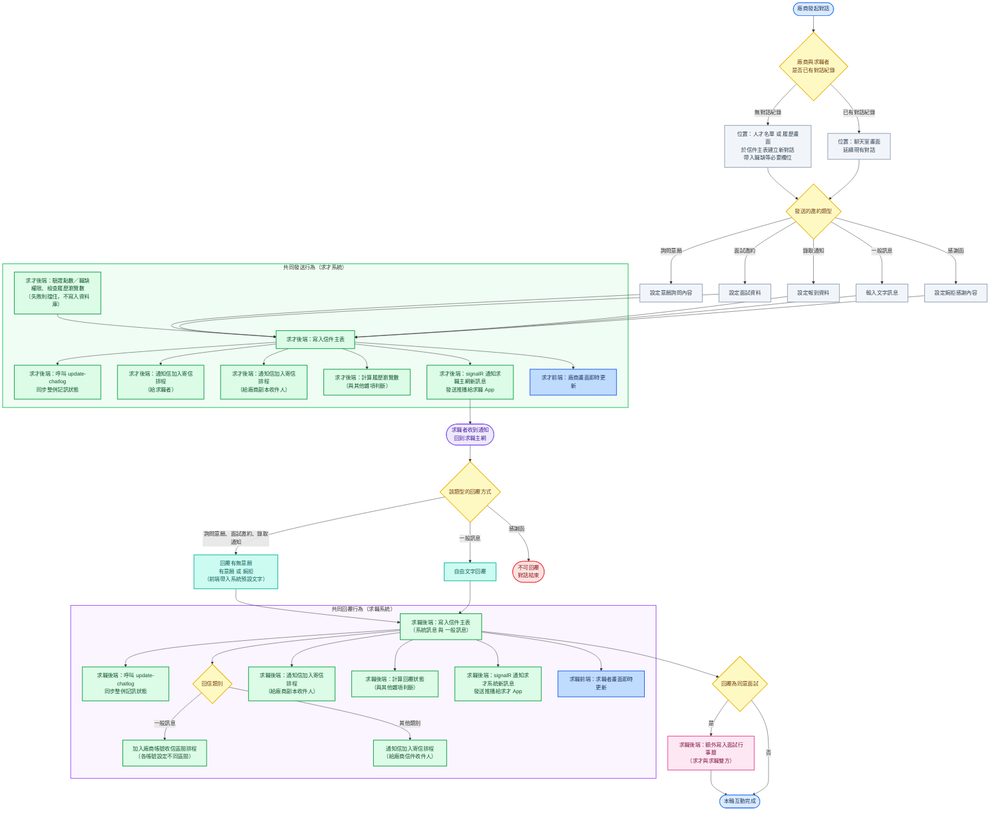
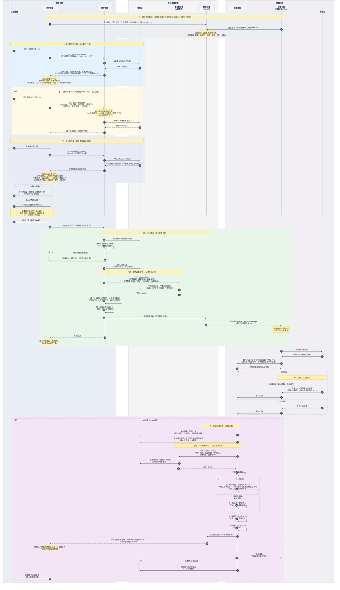

<!--markdownlint-disable MD033-->
<!--markdownlint-disable MD013-->

# 跨系統流程與後端邏輯

> 本章描述求才系統與求職系統之間的訊息收發後端／DB 邏輯，依完整系統流程圖整理。
> 主動方＝求才廠商；求職者收到通知後回到「求職主網」回覆。

## 進入頁面／搜尋／進聊天室（三支查詢 API）

聊天室相關資料載入，共用三支「信件即時通整併」API（權威文件見 `notes/api/` 對應檔）：

| 場景 | API | 說明 |
| :--- | :--- | :--- |
| 進入聯絡人才頁，載入左側聊天列表 | `GET get-echat-mail-logs`（`notes/api/echat-get-echat-mail-logs.md`） | limit＋cursor 分頁；回傳含 `oLastViewDate`／`tLastViewDate`／`lastUpdate`，可推導列表未讀判斷 |
| 搜尋關鍵字／切換一般·陌生訊息 Tab | `GET get-by-condition`（`notes/api/echat-get-by-condition.md`） | `sendType` 為陌生訊息判斷依據（0求才發信/1求職者先發信=陌生訊息/-1排除陌生訊息） |
| 進入聊天室，載入單筆對話明細 | `GET get-detail/{infoNo}`（`notes/api/echat-get-detail-infoNo.md`） | `infoNo`＝列表回傳的 `rNo`；回傳 `oJsonB`／`tJsonB` 訊息明細 |

## 共同發送行為（求才系統）

廠商送出任一類型（詢問意願／面試邀約／錄取通知／一般訊息／感謝函）後觸發：

| # | 動作 | 端 |
| :--: | :--- | :--- |
| 0 | 驗證廠商點數與職缺權限、計算並檢查履歷瀏覽數 —— **失敗則擋住，不寫入資料庫** | 求才後端 |
| 1 | 寫入信件主表 | 求才後端 |
| 1.5 | 呼叫 `POST update-chatlog`（`notes/api/echat-update-chatlog.md`）同步整併記訊狀態 | 求才後端 |
| 2 | 將「給求職者的通知信」**加入寄信排程**（不即時寄出，處理很快但非馬上送出） | 求才後端 |
| 3 | 將「給廠商副本收件人的信」加入寄信排程 | 求才後端 |
| 4 | 計算履歷瀏覽數（與其他雜項判斷） | 求才後端 |
| 5 | signalR 通知求職主網有新訊息、發送推播給求職 App | 求才後端 |
| 6 | 廠商畫面即時更新 | 求才前端 |

> 第 5 項（signalR／推播）為求職者收到通知、回到求職主網的觸發來源；連線機制見〈[SignalR / WebSocket 即時通連線機制](#signalr--websocket-即時通連線機制)〉。
>
> **第 4 項「計算履歷瀏覽數」細節**（舊版 [4.1 §5.2](/r1ghrPxP-x)）：寄出時寫入發信排程，執行排程時即時檢查廠商當日履歷瀏覽數是否足夠 —— 不足則不執行發信排程；足夠且成功寄出後扣除履歷瀏覽數。
>
> **寄出前檢查**（舊版 [4.1 §2.4／v1.0.4](/r1ghrPxP-x)，既有後端規則，新版沿用待確認）：
> 1. 含指定關鍵字 `留下LINE`（不分大小寫全半形）／`留下賴`：訊息仍寫入資料庫並標 `DELFLAG`、**不寄送 Email**，前台依求職規則顯示或隱藏。
> 2. 含違規字眼（如 `104`）：點「寄出」時不顯示 loading，直接 alert 阻擋送出（`內容含有違規字詞，請調整後再送出。`）。

## 共同回覆行為（求職系統）

求職者於求職主網回覆後，鏡像對應「共同發送行為」，執行端改為求職系統（列於此處供跨系統脈絡參照）：

| # | 動作 | 端 |
| :--: | :--- | :--- |
| 1 | 更新回覆／面試狀態（如「已接受」、`ReplyWishMsg`） | 求職後端 |
| 2 | 寫入信件主表＝自動寫入系統對話紀錄（系統訊息 與 一般訊息） | 求職後端 |
| 2.5 | 呼叫 `POST update-chatlog` 同步整併記訊狀態 | 求職後端 |
| 3 | 判斷回信類別：**一般訊息**→加入廠商帳號（信件收件人）的「**收信區間排程**」（每帳號設定的收信區間不同，依區間彙整寄出）；**其他類別**（意願回覆等）→加入一般寄信排程 | 求職後端 |
| 4 | 將「給廠商副本收件人的信」加入寄信排程 | 求職後端 |
| 5 | 計算回覆狀態（與其他雜項判斷） | 求職後端 |
| 6 | signalR 通知求才系統有新訊息、發送推播給求才 App | 求職後端 |
| 7 | 求職者畫面即時更新 | 求職前端 |

> 回覆完成後另判斷：若回覆為同意面試，求職後端額外寫入面試行事曆（求才與求職雙方）。
> 「回覆有無意願」分支由求職前端帶入系統預設文字（如「我有意願」）寫入一般訊息；自由文字回覆則由求職者自行輸入。

## 類型 → 回覆方式對照

| 發送的邀約類型 | 求職者回覆方式 | 回覆後特殊處理 |
| :--- | :--- | :--- |
| 詢問意願 | 回覆有無意願（有意願 / 婉拒） | — |
| 面試邀約 | 回覆有無意願（接受指定時段 / 婉拒面試 / 更改時間） | 接受 → 寫入面試行事曆；更改時間 → 求職者要求其他時段（後續流程 `待補`） |
| 錄取通知 | 回覆有無意願（同意報到 / 婉拒） | — |
| 一般訊息 | 自由文字回覆 | — |
| 感謝函 | 不可回覆，對話結束 | — |

> 後端 `ReplyWishMsg` 值對照（來源：`get-detail/{infoNo}` schema）：`0`未回覆／`1`有意願／`2`婉拒／`3`更改時間。

## 完整流程圖

## 完整流程圖（循序圖 Sequence Diagram）

> 與上方 `完整流程圖` 同一套邏輯，改以循序圖呈現，並整合工程端提供的前後端技術流程（原始版見 `notes/api/echat-engineering-sequence-original.md`）＋本次四支 API 的實際呼叫位置。依時間順序排列，並把「使用者／系統端」與「每個 action」分開。
>
> 較上一版新增：
> - 段〇：SignalR 常駐連線（兩端前端進入頁面即建立連線並保持，用於接收訊息）
> - 段一～三：進入聯絡人才頁載入列表／搜尋篩選／進聊天室載入明細，各自對應的查詢 API
> - 共同發送／回覆行為內插入 `update-chatlog` 整併同步呼叫
> - 驗證與檢查移至寫入資料庫之前，失敗以 `break` 表示擋住
> - 通知信一律「加入寄信排程」而非即時寄出；求職者回覆若為一般訊息，改走廠商帳號的「收信區間排程」

## SignalR / WebSocket 即時通連線機制

> 聊天室的即時訊息採 **SignalR**（底層走 WebSocket）做雙向即時推播：訊息送出後雙方畫面即時更新、不需重新整理。本章只記錄業務邏輯與相關名稱供對照；協定握手、連線升級等技術細節屬 RD 範疇，不在此展開。

### 連線時帶的資訊

使用者進入聊天室建立連線時，會帶上以下資訊辨識身分與頻道：

| 名稱 | 意義 |
| :--- | :--- |
| `Token` | 登入憑證（確認已登入） |
| `oNo` | 公司編號 |
| `uNo` | 使用者編號 |
| `echathub` | 聊天頻道名稱（全系統統一用這個） |

### 訊息資料格式（名稱對照）

每則即時訊息用三個欄位描述「在哪個頻道、做什麼動作、帶什麼資料」：

| 欄位 | 名稱 | 意義 |
| :--- | :--- | :--- |
| `H` | Hub | 頻道名稱，固定為 `echathub` |
| `M` | Method | 這則訊息要觸發的動作（見下方對照表） |
| `A` | Arguments | 該動作需要的資料（訊息內文、發送者 ID 等） |

> 為避免閒置斷線，系統會固定間隔自動偵測連線是否存活（心跳）。

### 業務流程

1. 發送者送出訊息 → 後端驗證、寫入資料庫、產生訊息編號（UUID）。
2. 後端即時推播給接收者 → 接收者畫面立即出現新訊息，不需重新整理。
3. 接收者讀取後 → 前端回報「已讀」，更新雙方的已讀狀態。

### 常用動作（Action）對照表

| 方向 | 動作名稱（M） | 說明 | 帶的資料（A） |
| :--- | :--- | :--- | :--- |
| 前端發送 | `setoUser` | 上線報到 | 公司名稱, 使用者名稱 |
| 前端發送 | `sendMsgPush` | 送出文字訊息 | 訊息內文, 發送者ID, 接收者ID |
| 後端推播 | `onTextMessage` | 接收文字訊息 | 訊息 UUID, 雙方ID, 訊息內文 |
| 前端發送 | `updateMsgReaded` | 標記訊息已讀 | 已讀對象的 ID 陣列 |
