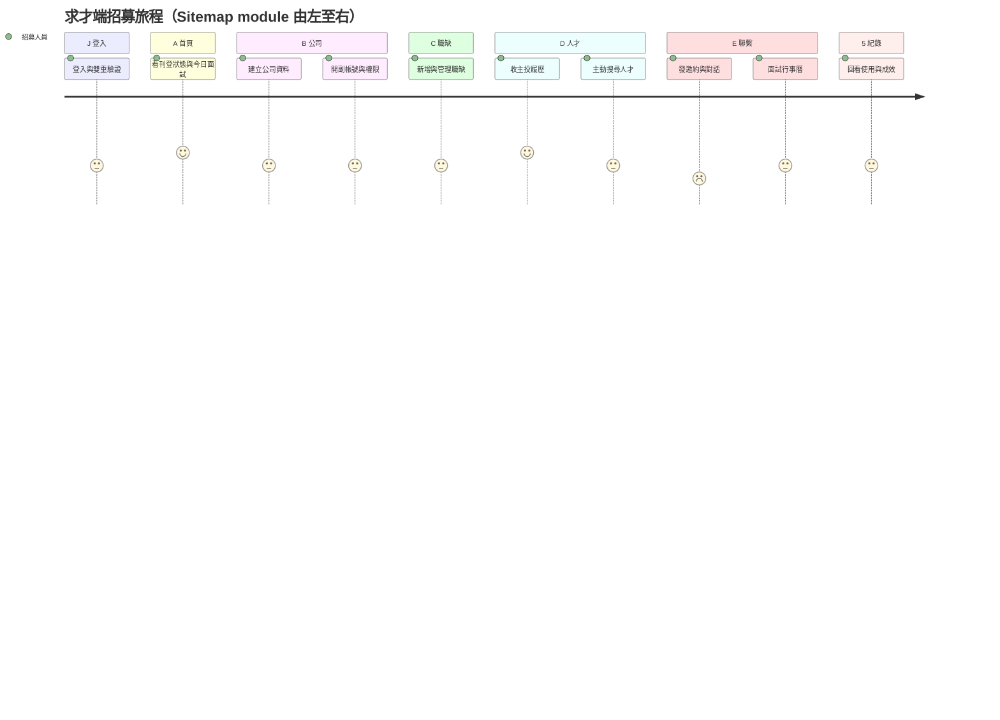

# 求才端 User Journey Map（招募人員）

- 來源：反向工程自 [求才系統 Sitemap](https://hackmd.io/@1111-jobdocs/rkGFjjlPWe) 的 module 順序＋團隊 HackMD 規格內的 User Story／Use Case／需求背景（2026-09-30 擷取，377 份中求才端約 120 份）。
- 方法與格式規則：`.claude/skills/user-journey-map/SKILL.md`。
- 標記：`US` = 文件內真實 User Story；`US*` = 套版句「以便提高求才效率」（只證明功能存在，不證明動機）；`NULL` = 文件未記載，不推測。
- 連結前綴：`https://hackmd.io/@1111-jobdocs/<shortId>`，下表只寫 shortId 文字。

---

## Persona 與情境

| 項目 | 內容 |
| :--- | :--- |
| 角色 | 企業 HR／招募人員（主帳號可開副帳號、分群組與權限） |
| 目標 | 從開通帳號到把人招進來：建立公司門面 → 刊登職缺 → 找人／收履歷 → 聯繫邀約面試 → 錄取 → 回看成效 |
| 主要變體 | VIP／免費VIP／關權／到期（刊登與權限不同，見 [B.4 刊登設定](https://hackmd.io/@1111-jobdocs/ryEY3vBZbl)、[REF 系統代碼表](https://hackmd.io/@1111-jobdocs/B1j3sN-bzx) `oStatus`）；Cake 特殊廠商（部分人才功能不可用，見 [A.1 Topbar](https://hackmd.io/@1111-jobdocs/Hym116n3-x) Cake 情境） |
| 支援泳道 | `服務`（說明頁、文件下載、滿意度）與 `購買`（續約、優先排序、簡訊加值）可在任何階段插入，不在主線 |

---

## 路由（找資料先看這裡）

階段編碼**沿用 HackMD 資料夾編碼**（`求才系統/` 下的 A.～E.、5.～7.，登入為 `J.`），不自編；Sitemap 的 1～9 是另一套 module 序號，僅在「Sitemap 第N節」引用。

| 編碼 | HackMD 資料夾 | 文件數 | 本檔章節 | Sitemap | 起手文件 |
| :--- | :--- | :---: | :--- | :--- | :--- |
| J | `求才系統/J. 登入流程與登入前` | 9 | [J. 登入](#J-登入) | 第1節 | r11ad8Okfe（登入前頁） |
| A | `求才系統/A. 首頁` | 12 | [A. 首頁](#A-首頁) | 第2節 | Hym116n3-x（A.1 topbar） |
| B | `B. 公司`＋`B.2 帳號設定`＋`B.4 刊登設定` | 23 | [B. 公司](#B-公司（公司資料-→-設定）) | 第3節 | S1jhD6RRbe（B.1） |
| C | `C. 職缺` | 13 | [C. 職缺](#C-職缺) | 第4節 | S1SfBeXxfe（2.2 新增職缺） |
| D | `求才系統/D. 人才` | 21 | [D. 人才](#D-人才（履歷-→-搜尋）) | 第5節 | HyYq_GgXWl（履歷詳細頁） |
| E | `E. 聯繫`＋`信件即時通合併專案` | 9＋12 | [E. 聯繫](#E-聯繫) | 第6節 | BJ0R8ocgGl（E.1 聯絡人才） |
| 5 | `求才系統/5. 紀錄` | 4 | [5. 紀錄](#5-紀錄) | 第7節 | S13Zy8rKze（5.5 人才點數） |
| 6／7 | `求才系統/6. 服務`、`求才系統/7. 購買` | 2＋3 | [6. 服務／7. 購買](#6-服務／7-購買（支援泳道）) | 第8、9節 | ByKdpLaWZe（7.1 線上續約） |
| 共用 | `M. Modal&Lightbox`、`[REF]` 代碼表 | 15＋ | 〈文件關係〉末段 | — | B1j3sN-bzx（REF 系統代碼表） |

編輯流程：改事實 → 先到上表「HackMD 資料夾」找原文件修 → 再改對應章節的表格與〈文件關係〉。完整目錄見 repo 根目錄 `tree.md`。

## 總覽

> 分數是依文件記載的痛點多寡**相對標示**（聯繫階段痛點最多），不是用戶研究數據；沒有 UX 研究佐證。

---

## 各階段

### J. 登入

| 泳道 | 內容 | 來源 |
| :--- | :--- | :--- |
| 目標 | 快速了解系統服務並安全登入 | US [招募系統登入前頁](https://hackmd.io/@1111-jobdocs/r11ad8Okfe) |
| 行動 | 登入前試搜人才 → 登入 → 雙重驗證（Email 連結）→ 忘記帳號／密碼時重設 | [人才試搜列表](https://hackmd.io/@1111-jobdocs/Sk4CnTjgMg)、[登入功能](https://hackmd.io/@1111-jobdocs/rych3fo0bl)、[J.1.7 雙重驗證](https://hackmd.io/@1111-jobdocs/ryqrsG2lWg)、[忘記密碼](https://hackmd.io/@1111-jobdocs/HJT3dH_vWg)、[忘記帳號](https://hackmd.io/@1111-jobdocs/SJNKOS_D-g) |
| 接觸點 | login.aspx、AgentVerify.aspx、AgentVerifyCheck.aspx | Sitemap 第1節 |
| 想法／情緒 | NULL（文件未載） | — |
| 痛點 | 部分廠商沒有信箱，新驗證機制會造成登入困難（客服反映） | [同步會議 2026.04.08](https://hackmd.io/@1111-jobdocs/Sk8KaX73Wl) |
| 機會點 | 登入異常情境統一 Alert；登入前智能客服（每日 3 次） | [登入特殊狀態與Alert](https://hackmd.io/@1111-jobdocs/HJb5FnCGZg)、[求才智能客服](https://hackmd.io/@1111-jobdocs/Hy95Qz7g-e) |

### A. 首頁

| 泳道 | 內容 | 來源 |
| :--- | :--- | :--- |
| 目標 | 一進來就掌握會員／刊登狀態與當週面試 | US [A.5 面試行事曆](https://hackmd.io/@1111-jobdocs/B1MejWhvGl)、US [A.1.7 異常狀態列](https://hackmd.io/@1111-jobdocs/SkJEsXNWMx) |
| 行動 | 看快訊與刊登狀態 → 點近期修改職缺 → 看今日面試／匯出行事曆 → 人才秒搜 | [A.2&A.3](https://hackmd.io/@1111-jobdocs/Bye3E5tl-g)、[A.4](https://hackmd.io/@1111-jobdocs/HJIK-sUGbe)、[A.5](https://hackmd.io/@1111-jobdocs/B1MejWhvGl)、[A.10](https://hackmd.io/@1111-jobdocs/BkIIbQYfWe) |
| 接觸點 | 首頁、Topbar（公告、通知、帳號選單、異常狀態列） | [A.1](https://hackmd.io/@1111-jobdocs/Hym116n3-x)、[A.1.3](https://hackmd.io/@1111-jobdocs/HkTiVy7Z-e)、[A.1.4&A.1.5](https://hackmd.io/@1111-jobdocs/SJsQkWsWbg)、[A.1.6](https://hackmd.io/@1111-jobdocs/ryik5PAZWl) |
| 想法／情緒 | NULL | — |
| 痛點 | 會員／刊登異常不易察覺（異常狀態列存在的理由） | US [A.1.7](https://hackmd.io/@1111-jobdocs/SkJEsXNWMx) |
| 機會點 | Topbar 通知收斂為只剩來訪人才（第三階段） | [聯絡人才第三階段](https://hackmd.io/@1111-jobdocs/Hk3SOQrFfg) |

### B. 公司（公司資料 → 設定）

| 泳道 | 內容 | 來源 |
| :--- | :--- | :--- |
| 目標 | 公司頁資訊完整正確；讓團隊成員各自有帳號與權限 | US [B.1 公司資料修改與進度條](https://hackmd.io/@1111-jobdocs/S1jhD6RRbe) |
| 行動 | 填基本資料 → 形象／工作環境／產品服務／福利／更多介紹 → 上傳面試須知 → 選版型 → 預覽送審；取公司頁 QR Code → 在設定開副帳號、設通知與權限、群組、聯絡人、刊登設定 | B.1.x 各分頁（見〈文件關係〉）、US [B.1.3 官方連結](https://hackmd.io/@1111-jobdocs/SkztPlKsbx)、[B.2 帳號設定](https://hackmd.io/@1111-jobdocs/SkfafU2WZg) |
| 接觸點 | /company/*、/settings/*、VipSchedule.aspx、PublishEmpGroup.aspx | Sitemap 第3節 |
| 想法／情緒 | NULL | — |
| 痛點 | 內部 IP 上傳圖片有侵權風險，需對外下架（僅後台可見） | [B.1.4 工作環境](https://hackmd.io/@1111-jobdocs/Sy6vKV4FZx) |
| 機會點 | 三種新增帳號方式（含複製帳號）；刊登設定取代開關天數設定 | [帳號設定改版 功能說明頁](https://hackmd.io/@1111-jobdocs/rynOybVWZx)、[新增帳號Modal](https://hackmd.io/@1111-jobdocs/rkciNnFHMg)、[B.4 刊登設定](https://hackmd.io/@1111-jobdocs/ryEY3vBZbl) |

### C. 職缺

| 泳道 | 內容 | 來源 |
| :--- | :--- | :--- |
| 目標 | 依不同招聘情境快速完成職缺刊登 | US [2.2 新增職缺](https://hackmd.io/@1111-jobdocs/S1SfBeXxfe) |
| 行動 | 快速新增／複製／全新／匯入職缺 → 設應徵過濾 → 在總覽多筆操作（更新日期、開關、改工作時間）→ 排序、移轉、排廣告 | [2.2](https://hackmd.io/@1111-jobdocs/S1SfBeXxfe)、[複製職缺](https://hackmd.io/@1111-jobdocs/HJW-MWp4Wg)、[匯入職缺](https://hackmd.io/@1111-jobdocs/Bk854rrtGe)、[應徵過濾](https://hackmd.io/@1111-jobdocs/r1AirkvF-x)、[2.1 職缺總覽](https://hackmd.io/@1111-jobdocs/HJvxSmNMWe)、[職缺列表多筆操作](https://hackmd.io/@1111-jobdocs/rJvOFkwFbl)、[多筆修改：工作時間](https://hackmd.io/@1111-jobdocs/HkHIwU8Y-x)、[2.3](https://hackmd.io/@1111-jobdocs/B1Srfpi7bg)、[2.4](https://hackmd.io/@1111-jobdocs/rJ5KsWEG-e)、[2.7](https://hackmd.io/@1111-jobdocs/Sy7bgNuzZg) |
| 接觸點 | PublishList／PublishOpening／PublishEmpSort／PublishEmpTrans／BuyScheduleBooking.aspx | Sitemap 第4節 |
| 想法／情緒 | NULL | — |
| 痛點 | 在其他人力銀行已刊登的職缺要手動重建 | US [職缺匯入提案](https://hackmd.io/@1111-jobdocs/BJATOLPwbx) |
| 機會點 | 職缺匯入；AI 職缺審核 | [職缺匯入提案](https://hackmd.io/@1111-jobdocs/BJATOLPwbx)、[職缺審核導入AI提案](https://hackmd.io/@1111-jobdocs/B1bkIvMhZx) |

### D. 人才（履歷 → 搜尋）

| 泳道 | 內容 | 來源 |
| :--- | :--- | :--- |
| 目標 | 依職缺管理應徵名單；主動接觸有意願的人才 | US [3.1.1 主動應徵職缺選單](https://hackmd.io/@1111-jobdocs/S1I24H-lzl)、US [3.1.4 來訪名單](https://hackmd.io/@1111-jobdocs/rkMnZsqu-g) |
| 行動 | 看主動應徵 → 開履歷詳細頁 → 追蹤／備註／封鎖／轉寄／列印 → 看來訪名單 → AI 推薦／配對／簡易／進階／大專搜尋 | [3.1.1 列表](https://hackmd.io/@1111-jobdocs/ry9S7kjuWe)、[3.0 履歷詳細頁](https://hackmd.io/@1111-jobdocs/HyYq_GgXWl)、[追蹤人才Lightbox](https://hackmd.io/@1111-jobdocs/r1V8b3ZDWg)、[備註 Lightbox](https://hackmd.io/@1111-jobdocs/rkX_P2qqZl)、[轉寄履歷](https://hackmd.io/@1111-jobdocs/ByoEYp2a-g)、[列印履歷 lightbox](https://hackmd.io/@1111-jobdocs/SJMq3nfkGe)、[3.2.6 AI推薦](https://hackmd.io/@1111-jobdocs/r1TBqJjeGx)、[3.2.1](https://hackmd.io/@1111-jobdocs/Bk06kDtf-l)、[3.2.2](https://hackmd.io/@1111-jobdocs/BkMNTH_Pfe)、[3.2.3](https://hackmd.io/@1111-jobdocs/Syn7AN87Wl)、[3.2.4](https://hackmd.io/@1111-jobdocs/SJleDiy9bl) |
| 接觸點 | ResumePool*.aspx、ResumeSearch*.aspx、ResumeDetailShow.aspx | Sitemap 第5節 |
| 想法／情緒 | NULL | — |
| 痛點 | 來訪名單無法過濾（狀態、日期、性別、年齡）；追蹤名單不能直接刪除；看不到誰關注了公司／職缺 | US [現版人才來訪拉皮更新](https://hackmd.io/@1111-jobdocs/SJ5oUbXv-g)、US [追蹤人才Lightbox](https://hackmd.io/@1111-jobdocs/r1V8b3ZDWg)、US [關注名單](https://hackmd.io/@1111-jobdocs/B1jNIrMBZl) |
| 機會點 | 關注名單（數字與名單一致）；來訪名單過濾 | [關注名單 Proposal](https://hackmd.io/@1111-jobdocs/B1jNIrMBZl)、[關注名單](https://hackmd.io/@1111-jobdocs/rygtdmRNZl) |

### E. 聯繫

| 泳道 | 內容 | 來源 |
| :--- | :--- | :--- |
| 目標 | 在單一介面集中管理與每位求職者的對話並直接發邀約；有效率管理面試 | US [E.1 聯絡人才](https://hackmd.io/@1111-jobdocs/BJ0R8ocgGl)、US [4.3 面試行事曆](https://hackmd.io/@1111-jobdocs/HydajKbPfl) |
| 行動 | 開通知 Lightbox → 選範本 → 發詢問意願／面試邀約 → 在聊天室對話 → 建立／改期／取消面試 → 錄取通知；失約時回報 | [4.0 通知 Lightbox](https://hackmd.io/@1111-jobdocs/r1qJb-uXbx)、[範本Lightbox](https://hackmd.io/@1111-jobdocs/SJ8KDMo8fl)、[E.2.1 信件範本](https://hackmd.io/@1111-jobdocs/HyDIQwJUWg)、[4.1 信件列表](https://hackmd.io/@1111-jobdocs/rJkyKgeGWl)、[信件對話](https://hackmd.io/@1111-jobdocs/r1ghrPxP-x)、[第二階段](https://hackmd.io/@1111-jobdocs/ry_GPNuZze)、[失約回報](https://hackmd.io/@1111-jobdocs/Sy70gCPKGe) |
| 接觸點 | ResumePoolNoticeMail(Detail).aspx、Exemplar.aspx、oInterView.aspx、SMS.aspx、右下角即時通面板 | Sitemap 第6節、[即時通面板](https://hackmd.io/@1111-jobdocs/SJsYLtmr-g) |
| 想法／情緒 | 不滿：即時通和信件分開計算限時回應 | [即時通、信件通知合併](https://hackmd.io/@1111-jobdocs/SJJY3isYZe) |
| 痛點 | 兩套工具（面試邀約＋即時通）各自溝通、副帳號通知兩組設定；勾「希望 N 天內回覆」後訊息沒顯示期限；範本不能排序置頂；求職者失約 | [SJJY3isYZe](https://hackmd.io/@1111-jobdocs/SJJY3isYZe)、[信件對話](https://hackmd.io/@1111-jobdocs/r1ghrPxP-x)、US [E.2.1](https://hackmd.io/@1111-jobdocs/HyDIQwJUWg)、US [失約回報](https://hackmd.io/@1111-jobdocs/Sy70gCPKGe) |
| 機會點 | 信件＋即時通整併、訊息收回、已讀、附檔；詢問意願與面試邀約拆開；同意面試後自動建立行事曆；用錄取通知追蹤招募成效 | [SJJY3isYZe](https://hackmd.io/@1111-jobdocs/SJJY3isYZe)、[各階段開發內容](https://hackmd.io/@1111-jobdocs/r1eNVEfmMx)、[第三階段](https://hackmd.io/@1111-jobdocs/Hk3SOQrFfg) |

### 5. 紀錄

| 泳道 | 內容 | 來源 |
| :--- | :--- | :--- |
| 目標 | NULL（套版 US*，未寫動機） | US* [5.6 數據統計查詢](https://hackmd.io/@1111-jobdocs/SJeZiGSMbx) |
| 行動 | 看帳號邀約紀錄 → 履歷瀏覽紀錄 → 帳號使用／購買紀錄 → 數據統計 → 人才點數 | [5.1](https://hackmd.io/@1111-jobdocs/rJ5Bp4RE-g)、[5.3 購買紀錄](https://hackmd.io/@1111-jobdocs/S1-Wt68M-e)、[5.6](https://hackmd.io/@1111-jobdocs/SJeZiGSMbx)、[5.5 人才點數查詢](https://hackmd.io/@1111-jobdocs/S13Zy8rKze)、[記錄管理 Lightbox](https://hackmd.io/@1111-jobdocs/Sk4AvcZ-We) |
| 接觸點 | Log*.aspx | Sitemap 第7節 |
| 想法／情緒 | NULL | — |
| 痛點 | NULL | — |
| 機會點 | 錄取通知作為招募成效數據（與聯繫階段連動） | [SJJY3isYZe](https://hackmd.io/@1111-jobdocs/SJJY3isYZe) |

### 6. 服務／7. 購買（支援泳道）

| 泳道 | 內容 | 來源 |
| :--- | :--- | :--- |
| 目標 | 合約到期前續約；不寄 Email 就能把紙本合約交給客服；遇到招募問題直接問 | [7.1 線上續約](https://hackmd.io/@1111-jobdocs/ByKdpLaWZe)、US [H.3 合約上傳](https://hackmd.io/@1111-jobdocs/HJD1Eu0c-e)、US [求才智能客服](https://hackmd.io/@1111-jobdocs/Hy95Qz7g-e) |
| 行動 | 續約 → 購買優先排序／簡訊加值 → 上傳合約；下載文件、填滿意度 | [7.2](https://hackmd.io/@1111-jobdocs/HJzsieKfWe)、[A.7.1 文件下載](https://hackmd.io/@1111-jobdocs/Sk5kyX6ubx)、[6.8 滿意度調查](https://hackmd.io/@1111-jobdocs/S1fR49Fg-l) |
| 痛點 | 薪資行情與法規疑問、新廠商學習成本 | US [求才智能客服](https://hackmd.io/@1111-jobdocs/Hy95Qz7g-e) |

---

## 文件關係（階段 → 功能 → 文件）

| 階段 | 功能 | 文件 |
| :--- | :--- | :--- |
| J 登入 | 登入前頁／試搜 | r11ad8Okfe、Sk4CnTjgMg、Hyt5LqcyMl |
| J 登入 | 登入／驗證／找回 | rych3fo0bl、HJb5FnCGZg、rk0aZy0aZg、ryqrsG2lWg、HJT3dH_vWg、SJNKOS_D-g |
| A 首頁 | Topbar | Hym116n3-x、HkTiVy7Z-e、SJsQkWsWbg、ryik5PAZWl、SkJEsXNWMx |
| A 首頁 | 首頁區塊 | Bye3E5tl-g、HJIK-sUGbe、B1MejWhvGl、BkIIbQYfWe |
| B 公司 | 公司資料 | S1jhD6RRbe、ryUoKHCG-e、SJhAVOy8Wg、SkztPlKsbx、Sy6vKV4FZx、Hk7HExLUWx、HJvhE8BFWe、BJEWK648bx、S1HPE5EU-e、ByA4t_-cZg、H1ZbConBbl、HkSJkuy8bx |
| B 公司 | 設定 | SkfafU2WZg、BytSsxD8be、Bk1uH5fXbx、BJGdoePUWl、SyKtjeP8We、rkciNnFHMg、SkdiYvsnZe、S1G_8GQbZe、ryEY3vBZbl、Bkw7pIVLbx、By5Eo8NvZx、SJ0mjWHvZx |
| C 職缺 | 建立 | S1SfBeXxfe、HJW-MWp4Wg、Bk854rrtGe、BJATOLPwbx、B1bkIvMhZx、BJ7Yob8W-g（職缺內容欄位） |
| C 職缺 | 管理 | HJvxSmNMWe、B1pOwHZQ-e、rJvOFkwFbl、HkHIwU8Y-x、r1AirkvF-x、B1Srfpi7bg、rJ5KsWEG-e、Sy7bgNuzZg |
| D 人才 | 履歷 | ry9S7kjuWe、S1I24H-lzl、Byy7rOTM-x、B19dalQ-Zx、rkMnZsqu-g、SJ5oUbXv-g、rk8RQxMXzg、rkkn5BZQ-g、B1jNIrMBZl、HyYq_GgXWl、H18Vo3zyMx |
| D 人才 | 搜尋 | r1TBqJjeGx、Bk06kDtf-l、BkMNTH_Pfe、Syn7AN87Wl、SJleDiy9bl、SkyLndUmWe、BkCVW1nXbg、SyvesCVEbg、rygtdmRNZl |
| E 聯繫 | 發通知 | r1qJb-uXbx、S1XwSUPBZg、H1OpoEs7fe、SJ8KDMo8fl、HyDIQwJUWg、BJt1Rj59Ze、BkXGV4BW-e |
| E 聯繫 | 對話（整併專案） | BJ0R8ocgGl、ry_GPNuZze、Hk3SOQrFfg、rJkyKgeGWl、r1ghrPxP-x、BJmM2cDGfl、SJJY3isYZe、r1eNVEfmMx、Hk87bluGMg、SkKwqvUFfg、SJsYLtmr-g |
| E 聯繫 | 面試 | HydajKbPfl、Sy70gCPKGe |
| 5 紀錄 | 紀錄 | rJ5Bp4RE-g、S1-Wt68M-e、SJeZiGSMbx、S13Zy8rKze、Sk4AvcZ-We |
| 6／7 服務購買 | 服務／購買 | Sk5kyX6ubx、S1fR49Fg-l、ByKdpLaWZe、HJzsieKfWe、HJD1Eu0c-e、Hy95Qz7g-e、SJtErv_lZl、rynOybVWZx |

**跨階段共用元件**（不屬單一階段）：無權限Alert ryACpaCAWe、帳號選擇 S13ZYP9jbg、群組選擇 ByhoS3trGg、職缺選單 r1jXRIzqGg、現版職缺選擇 BkxSWZuGWx、通訊錄 B1iOzIB9-e、新增封鎖 H1guSxywZe、代碼參考 B1j3sN-bzx／ryjSpM-tzg。

---

## 缺口（寫 journey 時發現）

- 約 30 份文件的 User Story 是套版句「以便提高求才效率」，沒有寫出真正動機（如 A.2、A.4、5.x、3.2.x、7.x）——這些階段的「目標」只能標 US*。
- 全部文件都**沒有情緒／想法**的記載（沒有訪談或可用性測試資料），情緒曲線只能從「抱怨」「客服反映」推。
- `紀錄` 階段沒有任何痛點或動機記載。
- Sitemap 上沒掛文件連結、這次也沒找到對應規格的頁面：公司相關訊息、上傳檔案、職缺同步、自動更新、職缺所屬群組、匯入名單、還原刪除履歷、問題履歷回報、即時通記錄、簡訊通知紀錄、帳號使用紀錄（除購買紀錄外）。
